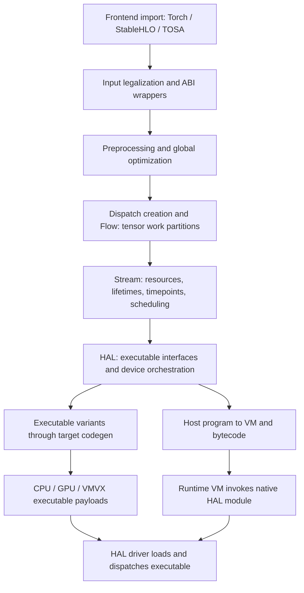

# IREE: a personal source map

For how this design differs from tinygrad, read the [cross-project comparison and coverage assessment](../design-comparison.md).

Snapshot: `2b05c5dbb2f2ecb27c0d3941e80ee8d2f16e890d`, inspected 2026-09-17. Checkout: `/home/boop/tenstorrent/iree` (new shallow clone; upstream `main` fetched and confirmed at this revision). Links below pin that exact revision. [Exercises with worked solutions](exercises.md). For reduction/producer/consumer **kernel boundaries**, start with [residual RMSNorm and dispatch fusion](rmsnorm-kernel-fusion.md), including an authored MLIR probe and actual upstream grouping/splitting tests.

This is a source-grounded orientation across the main compiler and runtime modules, with closer reading of the pipeline builders, Flow/Stream/HAL definitions, runtime interfaces, and copy-on-write tests. It is **not** a file-by-file audit of the repository, a benchmark, or evidence that every backend works. Module tables summarize responsibilities; the explanations of tradeoffs are interpretation unless explicitly attributed to source. No IREE build or execution was performed for this map. Third-party submodules were uninitialized when inspected.

## Start with the problem IREE solves

Suppose a Python function computes `y = (x + residual) * scale`. The math says which numbers to produce. Running it on an accelerator requires more decisions: which computations share a launch, where their arrays live, when each result is ready, and which compiled program the device should execute. IREE represents those decisions explicitly as compilation progresses. Its runtime is the code that loads the result and carries out those decisions when your application calls it.

An **operator** expresses a computation such as addition or RMSNorm. A **kernel** implements device work. A **dispatch** is an invocation of device work; the same compiled kernel can be dispatched many times. Combining several operators does not by itself prove that the final program launches fewer kernels.

Read this guide in order through the six stages, then use the module tables as an index. The [shared first-principles guide](../first-principles.md) supplies the vocabulary used across projects; the [RMSNorm walkthrough](rmsnorm-kernel-fusion.md) applies these stages to a complete computation.

## Start here if MLIR is new

An **intermediate representation (IR)** is a compiler's editable description of a program. MLIR provides operations with typed inputs and outputs; for example, an addition can produce an `f32` value. **SSA** means each result name is defined once, so its users can refer to that result unambiguously. A **block** is a sequence of operations; a **region** holds blocks inside another operation, such as a function or loop. A **dialect** supplies a related vocabulary of operations and types. A **verifier** checks the rules of that vocabulary; a **pass** analyzes or changes IR, and a **pass manager** runs passes in order.

MLIR provides this infrastructure: typed operations, SSA values, blocks and regions, dialect definitions, verification, rewrite machinery, and pass managers. IREE is a compiler and runtime built using that infrastructure. Its dialects express decisions needed to deploy tensor programs: how computation becomes dispatches, how resources live across asynchronous execution, and how a host program invokes devices. You can read an IREE `.td` file as the specification of an operation or type, then inspect its `.cpp` implementation and transform tests. You do not need to understand TableGen generation internals first.

An MLIR operation's dialect name tells you its vocabulary, not the complete compilation stage. Mixed dialects are normal: a Flow executable may contain Linalg, Tensor, Arith, and SCF operations; a host module can contain different levels while conversion proceeds. The central [pipeline builder][pipeline] and its [named phase boundaries][phases] are more reliable than guessing from a single operation.

For a tinygrad reader: a dialect is not a different Python class for each UOp phase, and a pass is not necessarily a pattern matcher. Passes may perform graph analysis, outlining, scheduling, allocation, conversion, or local rewrite. IREE's explicit boundary contracts are useful precisely because local algebraic equality alone cannot prove that a device buffer remains alive until a queued kernel completes.

## Follow one program through the compiler

This diagram describes the usual asynchronous tensor path. Device codegen is invoked **inside HAL processing**, not after all host VM lowering has finished. `HostOnly`, `InlineStatic`, and `InlineDynamic` execution models take different branches in [Pipelines.cpp][pipeline]; do not generalize the VM-plus-asynchronous-HAL path to every possible configuration.

### 1. Input conversion and public ABI

An imported model arrives in a frontend's vocabulary. **Legalization** rewrites it into forms the next stage accepts. The **ABI**, or application binary interface, specifies how caller and compiled program agree on arguments, results, and synchronization. A wrapper adapts the public call to the internal function. A **fence** communicates completion of asynchronous work; the coarse-fence ABI exposes synchronization at the call boundary.

The input plugins accept particular frontend dialects. Common legalization then establishes IREE-supported signatures and operations. Only after that does the compiler generate public entry wrappers, because input conversion can change exported types. The ordinary native ABI and the coarse-fence asynchronous ABI are selected from execution-model options. Read [input plugins][input], [entry-point wrapping][bindings], then the first half of [Pipelines.cpp][pipeline].

Why this abstraction exists: the shape and object representation convenient for an imported model is not automatically a stable calling convention for an embedding application. A wrapper separates the user's exported function from the internal representation and synchronization protocol.

Sharp edge: accepting a dialect syntactically does not establish that every operation or type in it is supported. A plugin must be included in the compiler build, and input conversion must meet downstream legality requirements. An external async ABI also gives the caller synchronization responsibilities that a synchronous-looking tensor API can hide.

### 2. Global optimization and dispatch creation

Here the question is “which computations should run together?” Elementwise operations compute each output coordinate independently; a **reduction**, such as `sum(x, axis=-1)`, combines many coordinates. A **producer** creates a value and a **consumer** uses it. Fusion joins their work so an intermediate might stay inside a dispatch instead of becoming an array passed between launches.

Preprocessing and global optimization operate before the program is fully divided into kernels. Constant evaluation can recursively invoke compilation/runtime machinery through injected hooks; the default pipeline explicitly disables that feature when the hook is unavailable. Dispatch creation handles fusion, reshapes, reduction splitting, and dispatch region formation. [Pipeline][pipeline]; [dispatch pass ordering][dispatch].

The ordering has a concrete rationale. The dispatch preprocessing pipeline performs elementwise fusion, moves reshapes to expose higher-dimensional fusion opportunities, then performs elementwise fusion again. These are not accidentally duplicated calls: one transform changes which patterns can match next. Later cleanup can also be needed because interprocedural optimization duplicates or inlines constants. This is the closest useful bridge to the question “why does this pattern matcher exist at this particular point?”

Sharp edge: fewer dispatches is not a universal optimization metric. Fusion can trade launches and intermediate traffic for duplicated computation or greater register/storage pressure. This is a performance hypothesis to measure on a target, not a correctness property established by a verifier.

### 3. Flow isolates host dataflow from dispatch bodies

The **host** is the application-side control program. A dispatch body describes work to run on a device. A **workgroup** is a cooperating group of workers; the dispatch **grid** describes how many groups to launch. **Outlining** moves an embedded body into a separately named executable, much as extracting a Python expression into a function leaves a call at the original location.

`flow.dispatch.region` groups work; workgroup dispatch operations give it a grid and explicit interface; outlining packages dispatch bodies into executables and replaces embedded bodies with calls. The Flow pipeline verifies input legality and initialization order, captures dynamic dimensions, and outlines dispatch regions. Read the operation descriptions in [FlowOps.td][flow] alongside [Flow/Transforms/Passes.cpp][flowpasses].

Why: once a dispatch boundary is explicit, the host can schedule the work without treating every tensor arithmetic operation as a host operation, and device codegen can optimize the body separately.

Sharp edges: dynamic tensor dimensions and dispatch workload dimensions are related but not interchangeable. A grid describes dispatched workgroups, not simply the tensor's rank or shape. An outlined executable is also not yet target machine code. Empty tensors have undefined contents unless a transform or producer initializes them; the Flow pipeline's optional zero-fill setting is not the default semantics.

### 4. Stream turns tensor value semantics into asynchronous resource semantics

At tensor level, `new = update(old)` describes a new value. At machine level, both values require bytes somewhere. **Aliasing** means two handles refer to overlapping storage. If a caller still needs `old`, writing `new` into that same storage would destroy a visible result. **Copy-on-write** makes a copy when needed to preserve the old value; ownership analysis can sometimes prove that no copy is needed.

Asynchrony adds another question. Submitting a kernel returns before it has necessarily finished. A **resource** represents storage being managed; a **timepoint** represents completion. Keeping a resource alive answers “may these bytes still be used?” Waiting for a timepoint answers “has the producer finished writing them?” Neither answer implies the other.

Read [StreamDialect.td][stream] before implementation files: it explains the layer unusually well. The progression is `stream.tensor.*` → `stream.async.*` → `stream.cmd.*`. Tensor encoding and shape information first become explicitly sized resources; resource operations then become scheduled command regions.

`!stream.resource` carries a lifetime classification such as external, staging, transient, variable, or constant. This classification guides management; it is not an actual allocation or a ready-to-dereference pointer. `!stream.timepoint` represents completion needed before results can be used. Symbolic byte sizes accompany resources even when dimensions are dynamic.

The [Stream pipeline][streampasses] makes the ordering concrete:

1. Verify input and convert to Stream tensor form.
2. Specialize/materialize encodings and verify resource lowering.
3. Materialize copy-on-write, eliminate provably unnecessary copies, and refine resource usage.
4. Check access ranges, place transfers, schedule execution/concurrency, and propagate timepoints.
5. Schedule allocation, place transients, pack constants, propagate subranges, and introduce reference counting.
6. Optimize and verify remaining command-level form.

Why: functional tensor updates can share storage only when aliasing and scheduling make that safe. Two values being mathematically equal does not mean that overwriting their shared storage is harmless. The [copy-on-write test][cow] shows block arguments cloned conservatively, while a locally created resource used in a single update chain can avoid cloning.

Sharp edge: SSA use order is not device completion order. Reusing memory after submitting work but before its completion can corrupt another operation. Stream's specification explicitly requires completion timepoints before resource use. Reference counting, allocation placement, and completion dependencies solve different parts of this problem; none substitutes for the others.

### 5. HAL commits interfaces and calls target codegen

**HAL** means hardware abstraction layer: a common interface to different devices. A **buffer** owns or refers to a range of bytes; a **view** adds an interpretation such as shape and element type. A **command buffer** records device commands. **Bindings** tell a kernel which buffers to use. An export **ordinal** is a numbered entry identifying which executable function to invoke. Agreeing on these details is as necessary as agreeing on the arithmetic.

**Code generation**, often shortened to codegen, turns the dispatch body into code for a chosen target. An executable **variant** is a version prepared for a particular target/configuration.

HAL represents buffer/view objects, command buffers, devices, executable interfaces, and synchronization. Its dialect is intentionally close to the runtime C HAL interface. See [HALDialect.td][hal] and [HAL pass assembly][halpasses].

The HAL pipeline materializes executable interfaces, configures target executables, translates their bodies, converts host Stream operations to HAL, links executables, resolves export ordinals, creates resource caches, and serializes executable payloads. Phase stops include `executable-sources`, `executable-configurations`, and `executable-targets`; they distinguish pre-configuration, strategy-selected, and translated device code. They are useful points for attributing a regression to scheduling versus code generation.

Why: a shared host scheduling model can support multiple device implementations while each executable variant has an appropriate target ABI and binary format. [Target plugins][plugins] connect that machinery to LLVM CPU, CUDA, ROCm, SPIR-V targets, and VMVX; [Codegen][codegen] contains transformations shared across or specialized for target families.

Sharp edge: compiler target backend names, runtime driver names, and executable formats are distinct namespaces. A compiler accepting a target does not imply the installed runtime has its driver, the current machine supports it, or the resulting binary matches that device. Dispatch binding layouts and ordinals are correctness contracts, not arbitrary metadata.

### 6. VM lowers the host control program; the runtime executes it

The **VM**, or virtual machine, executes portable instructions for host control: invoke a function, manage a reference, call a runtime service. **Bytecode** is the serialized instruction format it reads. A **native import** is a call from that bytecode to a service implemented outside it, such as the HAL runtime. This lets an application load a compiled module without turning every host-side control operation into device instructions.

The [VM pipeline][vm] legalizes host operations into VM form and [bytecode serialization][bytecode] emits the module representation. [HAL-to-VM conversion][halvm] connects HAL operations to runtime imports. The runtime [VM][vmruntime] handles modules, contexts, invocation, values/references, and bytecode execution; native modules provide functionality such as HAL and I/O.

The VM is not where GPU matrix multiply becomes GPU instructions. Those executable payloads were produced by target codegen. VMVX is a separate vector-oriented executable route; the similarly named VM and VMVX directories are not interchangeable.

There are at least three ABI boundaries to keep separate: application → exported module function; VM → native module imports; HAL dispatch → target executable entry point. The CPU [executable library header][executable] explicitly says incompatible schema changes require versioning or feature detection and coordinated compiler changes. Editing a struct and recompiling only one side is not a safe ABI update.

## Compiler module atlas

Use this table after following the pipeline above. “Lowering” means replacing a representation with more concrete implementation choices. **Bufferization** chooses physical buffers for tensor values; **tiling** divides an iteration space into chunks; an **encoding** describes storage/layout choices beyond the logical array shape. An **invariant** is a fact a stage requires to remain true. These words name obligations that explain why the modules are separate.

Paths in this table are relative to [`compiler/src/iree/compiler/`][compiler] unless stated otherwise. These are subsystem summaries, not claims that every implementation was inspected.

| Module | Why it exists / what to read | Sharp edge or question to bring |
|---|---|---|
| `API`, `Tools` | Embeddable compiler interfaces, sessions/invocations, CLI implementation. Start with `API/Internal/CompilerDriver.cpp` and `Tools/iree_compile_lib.cc`. | The CLI driver supplies hooks/configuration beyond a bare pass pipeline. |
| `PluginAPI`; `compiler/plugins/input` | Register frontend legalization extensions without putting every importer in core. | Build-time availability and dialect acceptance are separate. |
| `InputConversion/Common` | Shared legalization after input-specific processing. | Conversion failure often means an upstream contract was never established. |
| `Bindings/Native`, `Bindings/TFLite` | Generate invocation conventions for embedding environments. | Compiler bindings are ABI transforms, not the Python runtime bindings. |
| `Preprocessing` | User/plugin preprocessing before main lowering. | Moving a transform later may lose the structured operations it needs. |
| `GlobalOptimization`, `ConstEval` | Whole-program rewrites and compile-time evaluation of constants. | Compile-time cost and materialized constant size matter; JIT hooks can be required. |
| `DispatchCreation` | Fusion, reshape movement, reduction handling, dispatch partition formation. | A profitable partition is target/workload dependent. |

### Representations and their shared contracts

| Module | Why it exists / what to read | Sharp edge or question to bring |
|---|---|---|
| `Dialect/Flow`, `Stream`, `HAL`, `VM` | Successive representations of dispatches, scheduling/resources, device APIs, and host execution. | Each transition has legality checks and invariants beyond operation renaming. |
| `Dialect/Util` | Shared globals, initializers, function/value utilities, interfaces, and common transforms. | Initialization order and side effects constrain otherwise plausible rewrites. |
| `Dialect/LinalgExt` | Structured tensor operations and transforms beyond upstream Linalg. | Do not reduce structured ops too early if their semantics enable specialized lowering. |
| `Dialect/TensorExt` | IREE tensor-specific operations/interfaces. | Track shape metadata and tensor semantics through dispatch boundaries. |
| `Dialect/Encoding` | Represent target-oriented tensor encodings before concrete layout realization. | Logical shape is not sufficient to derive byte layout or storage size. |
| `Dialect/VMVX` | Operations for the VMVX executable path. | Distinct from host VM control flow and from CPU LLVM codegen. |

### Device code and pipeline integration

| Module | Why it exists / what to read | Sharp edge or question to bring |
|---|---|---|
| `Codegen/Common`, `Transforms`, `Utils`, `Interfaces`, `ExternalInterfaces` | Shared lowering and reusable analyses/interfaces for device bodies. | A transform can depend on tiling, bufferization, or interface preconditions. |
| `Codegen/LLVMCPU`, `LLVMGPU`, `SPIRV`, `VMVX`, `WGSL` | Target-family codegen pipelines. | Hardware features, supported types, and legal vector shapes differ. |
| `Codegen/Dialect/{Codegen,CPU,GPU,PCF,VectorExt}` | Carry codegen-specific operations/configuration and parallel/vector structure. | Tuning/configuration attributes do not remove the need to satisfy operation contracts. |
| `Dialect/HAL/Target`; `compiler/plugins/target` | Target interfaces, registration, executable translation/serialization. | A new backend involves runtime loading/dispatch as well as compiler lowering. |
| `Modules/HAL/{Inline,Loader}` | Alternate execution models for inline/static or dynamically loaded executables. | The usual async HAL/VM walkthrough does not describe every branch. |
| `Pipelines` | Whole-compiler phase composition and options. | Pass ordering is executable architecture; check this before old diagrams. |
| `ExternalInterfaces`, `Transforms`, `Utils`, `Reducer` | Cross-dialect integration, generic transforms/utilities, reduction tooling. | Reproducers must retain the attributes/options needed to reproduce the failure. |

The [dialect directory][dialects] provides the recurring reading pattern: `IR` for operation/type contracts and verifiers, `Transforms` for rewrites/pipelines, `Conversion` where present for representation changes, and adjacent tests for executable examples.

## Runtime, tools, and repository atlas

Read the runtime from the application inward: `runtime` offers convenient calls, `vm` executes module control, and `hal` submits work through a device driver. The other modules provide services these layers share. **Reference ownership** tracks who is responsible for retaining/releasing an object; it does not establish device completion. A **semaphore** is a synchronization object. **Marshaling** means packing arguments into the representation a callee expects. A **microkernel** is a small specialized compute implementation selected by a larger execution path.

Runtime paths below are relative to [`runtime/src/iree/`][runtime].

| Module | Why it exists | Sharp edge / good entry point |
|---|---|---|
| `base` | Status, allocators, synchronization/platform utilities shared by runtime layers. | Ownership and error propagation are part of every higher-level API. |
| `hal` | Device-neutral buffer, executable, queue, command, and semaphore interfaces. | Read `device.h` and `command_buffer.h` contracts before implementing a driver. |
| `hal/drivers/{local_sync,local_task,cuda,hip,amdgpu,vulkan,metal,webgpu,null}` | Concrete device implementations available in this source snapshot. | Source presence is not build enablement or a claim of equal maturity. |
| `hal/local` | CPU executable ABI, loaders, local executable/cache and dispatch support. | Standalone executable ABI header must agree with compiler-emitted code. |
| `task` | Task execution infrastructure, particularly relevant to CPU scheduling. | Host concurrency is distinct from compiler Stream timepoints. |
| `async` | Completion-based I/O/proactor infrastructure with platform implementations. | Its README says progress is caller-driven unless the optional thread wrapper is used; do not assume a background poller. |
| `vm`, `vm/bytecode` | Module execution, invocation, values, references, native/bytecode integration. | VM reference ownership is distinct from device-work completion. |
| `modules/{hal,io,vmvx,check}` | Native module services imported by compiled programs. | Import signatures and marshaling are ABI contracts. |
| `runtime` | Higher-level instance/session/call API over base/HAL/VM. | Convenience can add allocations/dependencies; lower-level APIs remain available. |
| `io` | Files and parameter storage/access infrastructure. | Model parameter storage and device residency need separate accounting. |
| `builtins` | Runtime builtins, including architecture-dependent microkernels. | Compiling a microkernel does not prove dispatch selected it. |
| `schemas` | Serialized-format definitions used across producers/consumers. | Schema changes cross compiler/runtime boundaries. |
| `tokenizer` | Tokenization facilities present alongside execution infrastructure. | Separate from tensor compiler passes; inventory only in this review. |
| `tooling`, `testing` | Shared CLI helpers and runtime test utilities. | A helper's default device/configuration can affect an experiment. |

Sources for deeper runtime reading: [HAL tree][halruntime], [device lifetime contracts][device], [driver inventory][drivers], [async architecture][async], and [higher-level API tradeoffs][highruntime]. The async README describes design intent; it is not evidence that every HAL driver uses every proposed facility.

| Repository area | What to use it for |
|---|---|
| [`runtime/bindings/python`][python], `runtime/bindings/tflite` | Host language/API integration; trace object conversion and lifetime into C runtime. |
| [`tools`][tools] | `iree-compile` for complete compilation, `iree-opt` for pass-level work, `iree-run-module` for execution, benchmark/dump/reduce tools for investigation. The real compiler CLI is under `compiler/.../Tools`. |
| [`tests`][tests] and tests beside compiler/runtime implementations | Top-level driver/end-to-end tests versus focused rewrite, verifier, and C/C++ tests. Pick the scope matching your claim. |
| [`samples`][samples] | Embedding, custom modules/dispatch, dynamic shapes, external transients, static libraries, compiler plugins. Good bridge from reading to modification. |
| [`build_tools`][build] | Build configuration, CI/test support, packaging workflows. A checkout is not a configured build. |
| `integrations`, `experimental` | Integration and exploratory areas; inspect their own requirements before treating them as production examples. |
| `docs` | Website/tutorial/design material; reconcile diagrams against pinned pipeline source. |
| `third_party`, `llvm-external-projects`, `lib` | Dependency/vendor and integration/support surfaces. IREE's pinned LLVM/MLIR may differ from another local LLVM checkout. See [submodule declarations][submodules]. |

## Contracts versus optimization: a review checklist with teeth

| Proposed change | Contract to establish | Optimization hypothesis to test |
|---|---|---|
| Fuse two dispatches | Preserve values, shapes, side effects, and legal dispatch interface. | Saved launches/traffic outweigh added computation and resource pressure. |
| Remove a Stream clone | No observable alias is overwritten; access ranges and completion dependencies remain valid. | Avoided copy/allocation reduces critical-path cost. |
| Reuse transient storage | Old uses complete before overlapping storage is reused. | Lower peak memory without introducing expensive serialization. |
| Change tensor encoding | All producers, consumers, storage-size calculations, and bindings agree. | Target-friendly layout saves more than conversions cost. |
| Change a native import or CPU executable struct | Both ABI sides agree on layout, signature, ownership, and supported version. | Faster calls or better dispatch scheduling. |
| Delete repeated canonicalization | Downstream transforms still receive legal and expected form. | Compilation time falls without losing later optimizations. |

A verifier pass is evidence of checks the compiler performs, not a proof of global equivalence or race freedom for arbitrary modifications. Use a small transform test for the local rewrite, execution tests for observable results, and target benchmarks for performance claims.

## Suggested reading sessions

1. **One hour:** [phase names][phases] → [pipeline builder][pipeline] → [Stream overview][stream]. Write down the new facts introduced at each boundary.
2. **Second session:** [dispatch ordering][dispatch] → [Flow outlining][flowpasses] → one emitted Flow module. Explain why fusion runs more than once.
3. **Third session:** [copy-on-write test][cow] → [implementation][cowimpl] → Stream pass ordering. Explain every inserted clone in one test chunk.
4. **Runtime session:** [device API][device] → [CPU executable ABI][executable] → a `samples/simple_embedding` program. Trace who owns buffers and who waits for completion.
5. **Project session:** choose an [exercise][exercises] and keep correctness evidence separate from performance evidence.

[exercises]: exercises.md

[pipeline]: https://github.com/iree-org/iree/blob/2b05c5dbb2f2ecb27c0d3941e80ee8d2f16e890d/compiler/src/iree/compiler/Pipelines/Pipelines.cpp
[phases]: https://github.com/iree-org/iree/blob/2b05c5dbb2f2ecb27c0d3941e80ee8d2f16e890d/compiler/src/iree/compiler/Pipelines/Pipelines.h
[input]: https://github.com/iree-org/iree/blob/2b05c5dbb2f2ecb27c0d3941e80ee8d2f16e890d/compiler/plugins/input
[bindings]: https://github.com/iree-org/iree/blob/2b05c5dbb2f2ecb27c0d3941e80ee8d2f16e890d/compiler/src/iree/compiler/Bindings/Native/Transforms/WrapEntryPoints.cpp
[dispatch]: https://github.com/iree-org/iree/blob/2b05c5dbb2f2ecb27c0d3941e80ee8d2f16e890d/compiler/src/iree/compiler/DispatchCreation/Passes.cpp
[flow]: https://github.com/iree-org/iree/blob/2b05c5dbb2f2ecb27c0d3941e80ee8d2f16e890d/compiler/src/iree/compiler/Dialect/Flow/IR/FlowOps.td
[flowpasses]: https://github.com/iree-org/iree/blob/2b05c5dbb2f2ecb27c0d3941e80ee8d2f16e890d/compiler/src/iree/compiler/Dialect/Flow/Transforms/Passes.cpp
[stream]: https://github.com/iree-org/iree/blob/2b05c5dbb2f2ecb27c0d3941e80ee8d2f16e890d/compiler/src/iree/compiler/Dialect/Stream/IR/StreamDialect.td
[streampasses]: https://github.com/iree-org/iree/blob/2b05c5dbb2f2ecb27c0d3941e80ee8d2f16e890d/compiler/src/iree/compiler/Dialect/Stream/Transforms/Passes.cpp
[hal]: https://github.com/iree-org/iree/blob/2b05c5dbb2f2ecb27c0d3941e80ee8d2f16e890d/compiler/src/iree/compiler/Dialect/HAL/IR/HALDialect.td
[halpasses]: https://github.com/iree-org/iree/blob/2b05c5dbb2f2ecb27c0d3941e80ee8d2f16e890d/compiler/src/iree/compiler/Dialect/HAL/Transforms/Passes.cpp
[vm]: https://github.com/iree-org/iree/blob/2b05c5dbb2f2ecb27c0d3941e80ee8d2f16e890d/compiler/src/iree/compiler/Dialect/VM/Transforms/Passes.cpp
[codegen]: https://github.com/iree-org/iree/blob/2b05c5dbb2f2ecb27c0d3941e80ee8d2f16e890d/compiler/src/iree/compiler/Codegen
[plugins]: https://github.com/iree-org/iree/blob/2b05c5dbb2f2ecb27c0d3941e80ee8d2f16e890d/compiler/plugins/target
[compiler]: https://github.com/iree-org/iree/blob/2b05c5dbb2f2ecb27c0d3941e80ee8d2f16e890d/compiler/src/iree/compiler
[dialects]: https://github.com/iree-org/iree/blob/2b05c5dbb2f2ecb27c0d3941e80ee8d2f16e890d/compiler/src/iree/compiler/Dialect
[runtime]: https://github.com/iree-org/iree/blob/2b05c5dbb2f2ecb27c0d3941e80ee8d2f16e890d/runtime/src/iree
[halruntime]: https://github.com/iree-org/iree/blob/2b05c5dbb2f2ecb27c0d3941e80ee8d2f16e890d/runtime/src/iree/hal
[device]: https://github.com/iree-org/iree/blob/2b05c5dbb2f2ecb27c0d3941e80ee8d2f16e890d/runtime/src/iree/hal/device.h
[executable]: https://github.com/iree-org/iree/blob/2b05c5dbb2f2ecb27c0d3941e80ee8d2f16e890d/runtime/src/iree/hal/local/executable_library.h
[vmruntime]: https://github.com/iree-org/iree/blob/2b05c5dbb2f2ecb27c0d3941e80ee8d2f16e890d/runtime/src/iree/vm
[async]: https://github.com/iree-org/iree/blob/2b05c5dbb2f2ecb27c0d3941e80ee8d2f16e890d/runtime/src/iree/async/README.md
[highruntime]: https://github.com/iree-org/iree/blob/2b05c5dbb2f2ecb27c0d3941e80ee8d2f16e890d/runtime/src/iree/runtime/README.md
[python]: https://github.com/iree-org/iree/blob/2b05c5dbb2f2ecb27c0d3941e80ee8d2f16e890d/runtime/bindings/python
[api]: https://github.com/iree-org/iree/blob/2b05c5dbb2f2ecb27c0d3941e80ee8d2f16e890d/compiler/src/iree/compiler/API
[bytecode]: https://github.com/iree-org/iree/blob/2b05c5dbb2f2ecb27c0d3941e80ee8d2f16e890d/compiler/src/iree/compiler/Dialect/VM/Target/Bytecode
[halvm]: https://github.com/iree-org/iree/blob/2b05c5dbb2f2ecb27c0d3941e80ee8d2f16e890d/compiler/src/iree/compiler/Dialect/HAL/Conversion/HALToVM
[cow]: https://github.com/iree-org/iree/blob/2b05c5dbb2f2ecb27c0d3941e80ee8d2f16e890d/compiler/src/iree/compiler/Dialect/Stream/Transforms/test/materialize_copy_on_write.mlir
[cowimpl]: https://github.com/iree-org/iree/blob/2b05c5dbb2f2ecb27c0d3941e80ee8d2f16e890d/compiler/src/iree/compiler/Dialect/Stream/Transforms/MaterializeCopyOnWrite.cpp
[drivers]: https://github.com/iree-org/iree/blob/2b05c5dbb2f2ecb27c0d3941e80ee8d2f16e890d/runtime/src/iree/hal/drivers
[tools]: https://github.com/iree-org/iree/blob/2b05c5dbb2f2ecb27c0d3941e80ee8d2f16e890d/tools
[clitool]: https://github.com/iree-org/iree/blob/2b05c5dbb2f2ecb27c0d3941e80ee8d2f16e890d/compiler/src/iree/compiler/Tools/iree_compile_lib.cc
[samples]: https://github.com/iree-org/iree/blob/2b05c5dbb2f2ecb27c0d3941e80ee8d2f16e890d/samples
[tests]: https://github.com/iree-org/iree/blob/2b05c5dbb2f2ecb27c0d3941e80ee8d2f16e890d/tests
[build]: https://github.com/iree-org/iree/blob/2b05c5dbb2f2ecb27c0d3941e80ee8d2f16e890d/build_tools
[submodules]: https://github.com/iree-org/iree/blob/2b05c5dbb2f2ecb27c0d3941e80ee8d2f16e890d/.gitmodules
