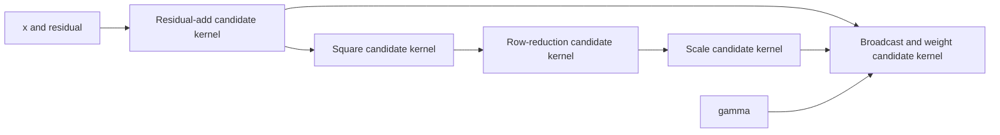

# Residual RMSNorm: the dispatch boundaries that matter

This case study focuses on **combining work that would otherwise require separate kernel dispatches**, especially a reduction and its producer/consumer kernels. It uses IREE `2b05c5dbb2f2ecb27c0d3941e80ee8d2f16e890d`, confirmed unchanged after fetching upstream `main` on 2026-09-17. It accompanies the [module map](README.md) and [exercise bank](exercises.md).

**Evidence:** the linked IREE tests specify actual dispatch-grouping expectations. They were read, not executed here. The [residual RMSNorm input](examples/residual-rmsnorm.mlir) is an authored, unexecuted probe. A repository-wide search for `rmsnorm`/`rms_norm` found no named example in this snapshot; nearby normalization/reduction tests provide the source evidence. No final kernel count, generated assembly, register footprint, or speedup is claimed for the authored probe.

## The workload, including the awkward multi-use edge

RMSNorm rescales each row by its root-mean-square magnitude, then applies a learned weight per column. Here `B` is the number of rows and `H` the number of columns (“hidden coordinates”). A residual is another array added before normalization. `rsqrt(a)` means `1/sqrt(a)`; the small positive `epsilon` keeps the denominator away from zero. Gamma is the learned column weight, reused across rows.

For row `b` and hidden coordinate `h`, compute:

```text
z[b,h] = x[b,h] + residual[b,h]
sum[b] = Σ_h z[b,h]²
scale[b] = rsqrt(sum[b] / H + epsilon)
y[b,h] = z[b,h] * scale[b] * gamma[h]
```

For a small arithmetic illustration, let one row of `x` be `[1, 2]`, its residual `[0, 1]`, and gamma `[1, 2]`. Then `z=[1,3]`, the squared values are `[1,9]`, the sum is `10`, and the mean is `5`. With epsilon `1e-5`, scale is `1/sqrt(5.00001)`, and the output is `[scale, 6*scale]`, approximately `[0.447213, 2.683279]`. This is an explanatory calculation, not an execution result for the supplied probe.

Notice the shape changes: `z` and its squares have shape `[B,H]`, while `sum` and `scale` have one number per row, shape `[B]`. The final multiplication **broadcasts** each row's scale across its `H` columns. This change from independent columns to a combined row and back is why the reduction boundary matters.

The provided input uses `B=2`, `H=128`, `f32`, and `epsilon=1e-5`. It separates residual addition, squaring, row reduction, scale computation, and final multiplication into structured operations so that dispatch partitioning is visible. This is not a claim that an ordinary frontend necessarily emits those exact five operations, nor that an unfused compiler creates exactly five kernels.



The fan-out from `z` is deliberate. `z` is used by both the reduction's producer chain and the final normalization. A compiler cannot reason about fusion only along `sum → scale → y`; it must handle the other use of `z`, and possibly preserve it if a surrounding model also returns the residual stream.

## What counts as kernel fusion here?

An MLIR operation is a unit in the compiler's description, not necessarily a launch. `linalg.generic` describes an array computation with explicit loop/indexing relationships. A Flow region groups operations; a Flow workgroup dispatch adds the launch grid and input/output interface. A dispatch **site** is one invocation in the host program, whereas an executable **definition** is reusable code.

Combining two scalar multiplies inside a `linalg.generic` body is operation-level fusion. Enclosing the reduction plus final broadcast consumer in one `flow.dispatch.region` is a candidate dispatch-level fusion decision. Converting that group into a single `flow.dispatch.workgroups` with a shared body gives stronger evidence that the compiler has combined the launch boundary. Flow outlining later turns that body into an executable entry and the host into a dispatch invocation. Sources: [dispatch formation][formation], [workgroup conversion][workgroups], [Flow pipeline][flowpipeline].

IREE usually forms these groups before target machine kernels exist. Therefore “fuse kernels” here means eliminate a would-be boundary during partition formation, not splice two already compiled GPU binaries together. To establish the final launch count, inspect the complete program through Stream/HAL and, when running, its dispatch trace. Count **dispatch sites**, not just distinct executable definitions: deduplication can reuse one executable at multiple sites.

## Three candidate schedules and their actual costs

A **materialized intermediate** is a temporary value written into storage for later work to read. A **live range** is the period over which a value must remain available. **Scratch** is temporary working storage; a **spill** moves a value out of scarce fast storage. **Occupancy** concerns how much work can reside on the hardware at once. Fusion may reduce transfers while keeping more values live, which can increase scratch/spills or reduce occupancy.

| Partition | Inter-dispatch values | Potential gain | Tradeoff to inspect |
|---|---|---|---|
| Separate producer, reduction, scale, output groups | Full-size `z`/square tensors and row values, depending on early fusion | Simple groups; target can schedule stages independently | Launch overhead and full-tensor traffic; retained values live across dispatches |
| Producer+reduction; scale+output | Row sum crosses boundary; `z` may cross or be recomputed | Avoid materializing squares; keep reduction target-friendly | Reload/recompute `z`; row boundary requires readiness and storage |
| Residual+square+reduction+scale+output together | No internal tensor must cross a host dispatch boundary; exported values still do | Remove launches and intermediate host-visible resources | Live ranges, scratch, collective reduction strategy, occupancy, and multi-use handling |

These are design alternatives, not observed partitions of the supplied input. “No host-visible intermediate” does **not** mean “no memory allocation anywhere.” A fused body may still allocate scratch or spill, and can reread input after computing the row reduction. Device codegen decides those details.

A row reduction also needs all of its contributing values before the final row scale is available. If a row is distributed over workgroups without an appropriate cross-workgroup synchronization strategy, simply putting its producer/consumer text in the same body is not enough. The target lowering must implement the dependence. Splitting a reduction can deliberately preserve a dispatch boundary to obtain parallel partial sums and a later merge.

## Source evidence A: reduction and normalization can share a dispatch

The tests below are compiler input files with textual assertions. A `RUN` line specifies the command; `CHECK` directives tell FileCheck what must appear in its output. Different check prefixes can belong to different command configurations. They describe expected transformed IR, not a measured execution trace.

In [form_dispatch_regions.mlir][regiontests], `fuse_scalar_reduction_with_parallel_consumer_shared_input` reduces `tensor<4xf32>` to a scalar and then computes `x/sum` over the original vector. Its CHECK expectations place the reduction and parallel consumer **inside one** `flow.dispatch.region`, returning the consumer's result. This is the structural analogue of the critical RMSNorm `reduce(z²) → broadcast(scale) → z*scale` boundary: the consumer uses both the reduced value and an input shared with the reduction.

The neighboring `fuse_scalar_reduction_with_scalar_consumer` checks that a full reduction and scalar division occupy one region. Its scope is narrower: it establishes that scalar postprocessing need not require its own dispatch, but by itself says nothing about a full-size broadcast consumer.

Crucial qualification: these `CHECK` prefixes belong to the test's **`aggressive-fusion=true`** RUN configuration. The same file also runs default and no-multi-use variants under different check prefixes. Do not present a `CHECK` assertion as a default-mode guarantee merely because all configurations share one file.

Even closer to a multi-stage normalization, `softmax_like_fusion` in that file has a reduction, row postprocessing, a second reduction, and a final broadcast/rsqrt/scale/bias consumer grouped into one region. Its bit-extension producer remains outside at that pass boundary. The arithmetic is normalization-like despite the function name; it is not a literal RMSNorm oracle. Its CHECKs demonstrate grouping across reduction/consumer boundaries, but not completed machine code or the eventual disposition of the outside producer.

## Source evidence B: look past regions to dispatch interfaces

In [dispatch_linalg_on_tensors.mlir][workgrouptests], the `softmax` test contains a max reduction, an exponentiation/sum reduction that returns both full-size values and row sums, and a final normalization. The checks put all three structured computations inside one `flow.dispatch.workgroups`, with an input dispatch-tensor load and an output dispatch-tensor store. The intermediate results feed operations inside that body.

That is stronger boundary evidence than “arith operations folded”: the row intermediate values do not appear as separate host dispatch results in the checked form. The test pipeline includes dispatch formation, producer cloning, workgroup conversion, and cleanup. It also explicitly sets `aggressive-fusion=true`; it does not establish identical behavior for every target/default configuration.

The same file's `batchnorm_training` groups a reduction and a three-result postprocessing operation into one workgroup dispatch with three output stores. Fusion can keep multiple outputs; it does not require pretending intermediate values have no external consumers. For residual RMSNorm with an exported residual stream, examine whether the residual becomes an additional result/binding, is recomputed, or remains a separate dispatch.

## Source evidence C: real reasons boundaries survive

Read [FormDispatchRegions.cpp][formation] as a set of gates, not a universal “fuse everything” switch. “All-parallel” means a consumer's output iterations are independent. A non-unit loop has more than one iteration. A dimension-only use asks for shape rather than tensor contents. A destination-style operation carries an output operand that describes a potential result destination. **Dominance** requires a value to be available on every path reaching its use; moving a producer must preserve that property. `mmt4d` is a blocked matrix-multiplication operation, mentioned here as a separate example of backend limits.

With that vocabulary, the gates are:

| Gate | What the source checks | RMSNorm consequence to investigate |
|---|---|---|
| Default consumer count | `getFusableUses` requires a single distinct non-dimension consumer in non-aggressive mode | Multi-use `z` or reused statistics can affect grouping; multiple operands in one user are not the same as multiple users |
| Parallel consumer requirement | General consumer fusion requires all consumer loops parallel | The final scaling op is a plausible consumer; a second reduction requires different handling than this branch |
| Iteration-space checks | Default mode checks relative loop counts; an additional check rejects consumers with more non-unit loops than the group root | Broadcasting a tiny reduced result into a much larger iteration space can preserve a boundary |
| Operand limit and fusion-group legality | Both producer/consumer paths consult group feasibility and operand count | Residual, gamma, extra outputs, dynamic dims, and additional fused context enlarge interfaces |
| Producer fusion mode | In non-aggressive mode, general producer fusion through a destination-style consumer's non-init input is rejected | A square/residual producer is not automatically absorbed just because the reduction consumes it |
| Multi-use producer option | `fuseMultiUseProducers` controls producer uses; external-use checks can still block movement | Aggressive mode is not permission to invalidate an external residual consumer |
| Block/dominance constraints | Producer and root must share a block; external users must allow movement | Moving a producer into a branch-local dispatch can make outputs unavailable to other uses |
| Backend/configuration limitations | Some mmt4d fusion is disabled with an explicit backend configuration TODO | Legal mathematics is not sufficient when codegen cannot represent the fused configuration |

A concrete negative test is `no_producer_fusion_with_use_from_above` in [region tests][regiontests]. A subtraction producer feeds both an existing dispatch region and a later multiply. The checks retain a separate subtraction dispatch and dependent consumer dispatches: the existing region's use prevents the desired movement. This is actual preserved-boundary evidence.

`producer_fusion_with_movable_external_use` in the same file compares multi-use settings. Its `NO-MULTI-USE` checks show separate producer/negate/multiply regions. Inspect the corresponding normal CHECKs to see how moving a legal external user changes the grouping opportunity. The general lesson for `z` is to inspect its whole use graph, including nested captures, rather than declaring every multi-use producer unfusable.

## Source evidence D: reduction splitting intentionally adds a kernel boundary

The complete dispatch-creation pipeline test [`pipeline_tests_split_reduction.mlir`][splitpipeline], `basic_reduction`, turns a length-4096 reduction into **two checked `flow.dispatch.workgroups` sites**. The first dispatch processes chunks of 64 into 64 partial results; the second reduces the partial-results tensor to a scalar. This is a direct counterexample to “the best reduction pipeline always emits one kernel.”

The narrower [`form_split_reduction_dispatches.mlir`][splittest], `split_reduction_static`, starts with shape `64x4096` and explicit split size 128. Its checked partial tensor is `64x32`; the final row reduction consumes that tensor outside the initial region. The narrow pass alone has not yet wrapped that final reduction into its eventual dispatch, so use the full pipeline test above when claiming two dispatches.

For a large-hidden-size, few-row RMSNorm, splitting may expose more parallel work at the price of an intermediate partial-sum tensor, another dispatch, and a changed reduction association. Whether scale/output fuses into the final reduction is a separate partition question. Float accumulation order and tolerance require explicit validation; performance evidence cannot substitute for it.

## Follow the retained boundary into memory and synchronization

For example, if dispatch A produces row sums and dispatch B uses them, B needs both a storage location containing those sums and a dependency ensuring A has finished. Merely having the buffer address is insufficient. See the [Stream/HAL explanation](README.md#4-stream-turns-tensor-value-semantics-into-asynchronous-resource-semantics) for the distinction between resource lifetime and readiness.

If `sum` or `z` exits one dispatch and enters another, Flow represents the value crossing the boundary. Stream lowers tensor encodings to resources, refines lifetimes, schedules execution, and tracks completion. The consumer must wait on the producing work's readiness; the resource must survive until all its uses complete. HAL then provides the executable bindings, commands, and synchronization realized by the runtime. Sources: [Stream specification][stream], [Stream pipeline][streampipeline].

If the boundary disappears, those *internal values* need not become separate host dispatch resources, but an exported residual value still must be observable. Fusion can reduce intermediate storage demand; it does not authorize dropping an externally visible result. Conversely, reusing the input or residual buffer depends on aliasing and lifetime analysis, not solely on the fact that the normalization is fused.

## Reproduce the source evidence and compile the RMSNorm probe

Requirements and version caveats are in [exercise setup](exercises.md#setup-and-evidence-limits). No commands below were run here; a matching compiler build is required. The source tests need `iree-opt` and `FileCheck` only, not an accelerator:

```bash
set -o pipefail
iree-opt \
  --pass-pipeline='builtin.module(util.func(iree-dispatch-creation-form-dispatch-regions{aggressive-fusion=true}))' \
  --split-input-file \
  "$IREE_SRC/compiler/src/iree/compiler/DispatchCreation/test/form_dispatch_regions.mlir" \
  | FileCheck "$IREE_SRC/compiler/src/iree/compiler/DispatchCreation/test/form_dispatch_regions.mlir"

iree-opt \
  --iree-dispatch-creation-pipeline='split-reduction=true' \
  --split-input-file \
  "$IREE_SRC/compiler/src/iree/compiler/DispatchCreation/test/pipeline_tests_split_reduction.mlir" \
  | FileCheck "$IREE_SRC/compiler/src/iree/compiler/DispatchCreation/test/pipeline_tests_split_reduction.mlir"
```

For the authored probe, compare final Flow grouping with aggressive fusion disabled/enabled, holding the target constant:

```bash
export IREE_RMS_INPUT=/home/boop/tenstorrent/boop-docs/compiler-maps/iree/examples/residual-rmsnorm.mlir
for fusion in false true; do
  iree-compile "$IREE_RMS_INPUT" \
    --iree-hal-target-device=local \
    --iree-hal-local-target-device-backends=llvm-cpu \
    --iree-dispatch-creation-enable-aggressive-fusion="$fusion" \
    --compile-to=flow \
    -o "$IREE_LAB_DIR/rmsnorm.fusion-$fusion.flow.mlir"
done
```

Then compile through `stream`, `hal`, and the final `.vmfb` using the chosen mode. The authored input uses `func.func`, suitable for the full compiler input path; focused region-formation tests instead use `util.func`, so do not run a `util.func(...)` nested pass directly on the unconverted probe and mistake its no-op result for failed fusion.

What to collect: number of host dispatch sites; each site's inputs/outputs; which site contains the reduction, scale, and final output; inter-dispatch tensor shapes; Stream allocation/readiness relationships; and the target codegen strategy. Only after those are known should an execution benchmark attribute gains to fewer kernels.

## Worked exercises for this case study

### 1. Why does RMSNorm challenge a generic producer-consumer fuse?

**Worked answer:** The reduction consumes `z` through its square chain, while the final scaling also consumes `z`. It changes iteration roles from hidden-dimension reduction back to parallel broadcast, and preserving a returned residual can require an additional output. A local scalar pattern does not settle those partition/interface questions.
### 2. What source proves a reduction/output boundary can disappear?

**Worked answer:** `fuse_scalar_reduction_with_parallel_consumer_shared_input` checks both operations inside one region under aggressive fusion; `softmax` in the workgroup test checks several normalization stages inside one workgroup dispatch. Cite the correct RUN configuration and distinguish these tests from the uncompiled RMSNorm input.
### 3. Does a fused dispatch guarantee no full-size scratch?

**Worked answer:** No. It removes that particular host-visible dispatch boundary; target bufferization, tiling, vectorization, and register allocation decide internal storage and rereads. Inspect lower IR and generated code.
### 4. What variant probes externally visible residuals?

**Worked answer:** Return both `%y` and `%z` from a copy of the input and update the function signature. Compare grouping and output bindings. The correct result must preserve `%z`; one dispatch with multiple outputs, extra dispatches, or recomputation are possibilities to observe rather than preselected answers.
### 5. What variant probes deliberate splitting?

**Worked answer:** Increase `H`, reduce `B`, and compare split-reduction-enabled/disabled pipelines while keeping arithmetic fixed. The split tests establish the mechanism, not a guaranteed profitability threshold or partition for every RMSNorm. Measure final dispatches, partial storage, and numerical tolerance.
### 6. Simple arithmetic oracle:

**Worked answer:** Set all `x=1`, residuals `0`, gamma `1`. Each output is `1/sqrt(1+1e-5)` (approximately `0.999995`), up to floating-point details. Also test varied magnitudes, nonuniform gamma/residual, and the exported-residual variant; the constant oracle alone cannot expose many indexing or reduction bugs.

[formation]: https://github.com/iree-org/iree/blob/2b05c5dbb2f2ecb27c0d3941e80ee8d2f16e890d/compiler/src/iree/compiler/DispatchCreation/FormDispatchRegions.cpp
[workgroups]: https://github.com/iree-org/iree/blob/2b05c5dbb2f2ecb27c0d3941e80ee8d2f16e890d/compiler/src/iree/compiler/DispatchCreation/ConvertDispatchRegionsToWorkgroups.cpp
[flowpipeline]: https://github.com/iree-org/iree/blob/2b05c5dbb2f2ecb27c0d3941e80ee8d2f16e890d/compiler/src/iree/compiler/Dialect/Flow/Transforms/Passes.cpp
[regiontests]: https://github.com/iree-org/iree/blob/2b05c5dbb2f2ecb27c0d3941e80ee8d2f16e890d/compiler/src/iree/compiler/DispatchCreation/test/form_dispatch_regions.mlir
[workgrouptests]: https://github.com/iree-org/iree/blob/2b05c5dbb2f2ecb27c0d3941e80ee8d2f16e890d/compiler/src/iree/compiler/DispatchCreation/test/dispatch_linalg_on_tensors.mlir
[splitpipeline]: https://github.com/iree-org/iree/blob/2b05c5dbb2f2ecb27c0d3941e80ee8d2f16e890d/compiler/src/iree/compiler/DispatchCreation/test/pipeline_tests_split_reduction.mlir
[splittest]: https://github.com/iree-org/iree/blob/2b05c5dbb2f2ecb27c0d3941e80ee8d2f16e890d/compiler/src/iree/compiler/DispatchCreation/test/form_split_reduction_dispatches.mlir
[stream]: https://github.com/iree-org/iree/blob/2b05c5dbb2f2ecb27c0d3941e80ee8d2f16e890d/compiler/src/iree/compiler/Dialect/Stream/IR/StreamDialect.td
[streampipeline]: https://github.com/iree-org/iree/blob/2b05c5dbb2f2ecb27c0d3941e80ee8d2f16e890d/compiler/src/iree/compiler/Dialect/Stream/Transforms/Passes.cpp
