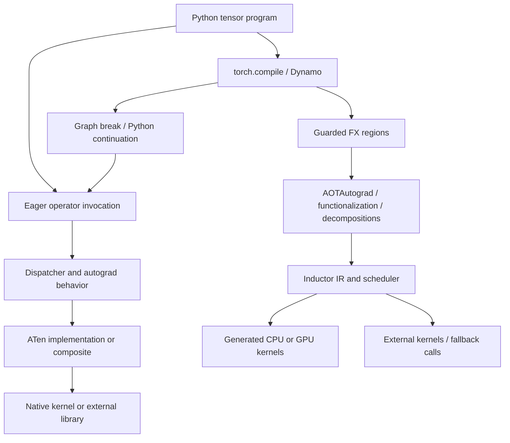

# PyTorch: eager execution and torch.compile

Start with `y = (x + 1) * 2`. In ordinary **eager execution**, Python reaches addition, asks PyTorch to execute it, then does the same for multiplication. With **`torch.compile`**, PyTorch can capture a supported region of the Python program and generate an implementation for that region. For example, a compiler may compute both operations in one loop without storing the entire intermediate `x + 1`. That is an opportunity, not a guarantee for every program.

An **operator** is a named tensor operation such as addition. A **kernel** is device code that performs work. A **graph** records operations and their dependencies. These are different levels: one operator may use several kernels, and one kernel may implement several operators. The shared [first-principles guide](../first-principles.md) introduces this vocabulary across projects.

PyTorch is useful to compare with tinygrad because its eager execution model
exists independently of its optimizing compiler. Start with
[eager execution](eager-execution.md#eager-execution), then [torch.compile capture](torch-compile.md#torch-compile)
and [Inductor lowering and fusion](inductor-and-fusion.md#inductor-and-fusion). The
[cross-project comparison](../design-comparison.md) explains what each design
makes easy, and which correctness obligations it creates.

## Source and execution provenance

There are two versions to keep separate: the source tree being explained and the installed package used to run examples. A **commit** identifies a particular source snapshot. A **wheel** is a packaged build that Python can import; cloning source does not replace that installed package.

The repository was newly cloned with:

```sh
git clone --depth=1 https://github.com/pytorch/pytorch.git pytorch
```

Source snapshot: upstream `main`,
`e52fd8ff9759e1c4bea7adcf63ca22717fe5e8df`, September 17, 2026.
The clean checkout is `/home/boop/tenstorrent/pytorch`. Third-party submodules
were not recursively cloned, and PyTorch was not built from this source.
[The source inventory](../inventory/pytorch.tsv) enumerates 22,345 Git tree
entries, including submodule entries; that is not a count of files audited.

The existing workspace environment imports **PyTorch 2.11.0+cu130**, built
from `70d99e998b4955e0049d13a98d77ae1b14db1f45`, from
`/home/boop/tenstorrent/.venv/lib/python3.13/site-packages/torch`.
Executed examples use that installed package on **CPU**, not the cloned main
revision. The [case study](rmsnorm-eager-vs-compile.md) records its environment,
checks, and artifacts separately. A captured kernel from that run is evidence
about that build, not proof of the newest source's generated output.

## Reading paths

If you know Python arrays, start with eager execution: it explains how a single call reaches numeric code and how gradients and shared storage complicate it. Then read capture and Inductor in order. **Capture** discovers a graph from Python execution; **lowering** translates it toward implementable loops and memory accesses; **scheduling** chooses how to group and order that work. Use the module map as a directory reference while following those paths. Finish with the RMSNorm case study to connect the architecture to actual generated code.

| Guide | What it explains | Exercises |
| --- | --- | --- |
| [Module map](module-map.md) | Public Python layers, native implementation, dispatch, code generation, compiler stacks, distributed/runtime subsystems, and supporting directories. | Source-tracing exercises in the guide. |
| [Regular eager execution](eager-execution.md#eager-execution) | Tensor calls, generated bindings, dispatch keys, backend kernels, autograd, views, mutation, and streams. | [Eager exercises and solutions](eager-execution.md#eager-exercises). |
| [torch.compile](torch-compile.md#torch-compile) | Python capture, guards, graph breaks, symbolic shapes, FX, functionalization, AOTAutograd, and runtime wrappers. | [Compile exercises and solutions](torch-compile.md#compile-exercises). |
| [Inductor](inductor-and-fusion.md#inductor-and-fusion) | Graph rewrites, loop/buffer IR, scheduling, kernel fusion, external calls, CPU/GPU codegen, autotuning, and caches. | [Inductor exercises and solutions](inductor-and-fusion.md#inductor-exercises). |
| [RMSNorm: eager versus compiled](rmsnorm-eager-vs-compile.md) | Actual CPU behavior, residual and matmul boundaries, backward, and capture/recompilation experiments, with recorded version limitations. | Reproducible probes and worked investigations. |

## Keep these boundaries distinct

The main names in the diagram each answer a different question. The **dispatcher** chooses an implementation for the current operator call; **ATen** is the tensor operator library. **Autograd** records and executes derivative computations. **Dynamo** captures supported Python execution into **FX**, a graph data structure. A **guard** checks assumptions used by a captured variant, such as input shape; a **graph break** ends a captured region and lets Python continue.

**AOTAutograd** prepares forward/backward graphs for compilation. **Functionalization** represents in-place updates and views in a compiler-friendly way while preserving visible effects. A **decomposition** expands an operator into simpler operations. **Inductor** uses an intermediate representation (**IR**) to choose loops, buffers, and generated code or external calls. These names locate responsibilities; the linked guides explain their mechanisms.

This diagram shows the ordinary eager route and the main compiler route with
the default Inductor backend. It is not a claim that every mode, custom backend,
training configuration, or export pipeline has precisely this path.



- **An autograd graph is not automatically a compiler graph.** Eager autograd
  records how to compute gradients while forward operations already execute.
  A captured FX graph instead gives a compiler a region to transform.
- **An operator is not a kernel.** A native operator may call a library, run
  multiple kernels, or expand into other operators. A compiled kernel can
  implement several source operators.
- **A captured graph is not a kernel.** `fullgraph=True` constrains capture;
  it does not promise one launch or erase reduction, layout, external-library,
  or synchronization boundaries.
- **Eager does not mean GPU-synchronous.** Host execution can dispatch work to
  an asynchronous device stream. Python sequencing and device completion are
  different concepts.
- **A decomposition is not a fusion proof.** Exposing an operation's arithmetic
  can enable scheduling choices, but also changes what patterns and numerical
  boundaries must be preserved.

The detailed guides cite the source implementing these distinctions. For a
small starting experiment, compare a decomposed RMSNorm expression with the
native functional operator in eager mode, then compile both. Count dispatcher
events (operator invocations), generated functions, external library calls, and materialized buffers (stored intermediate tensors) separately.
Do not interpret one profiler count as all four.

## Coverage limits

This is a module and pipeline atlas with worked source traces and selected
executed examples. It is sufficient to study the eager/compiler split and
compare the main abstractions with tinygrad. It is **not** a rule-by-rule audit
of all PyTorch, Inductor, Triton, ATen, or vendor library code. In particular,
the tinygrad reference's 926-template coverage guarantee does not transfer to
this much larger stack.

Backend hardware behavior, distributed execution, complete export/deployment
compatibility, every decomposition, and every optimization's correctness remain
outside the executed coverage. Existing source tests provide useful next
investigations; citing them does not mean they were run in this task.
