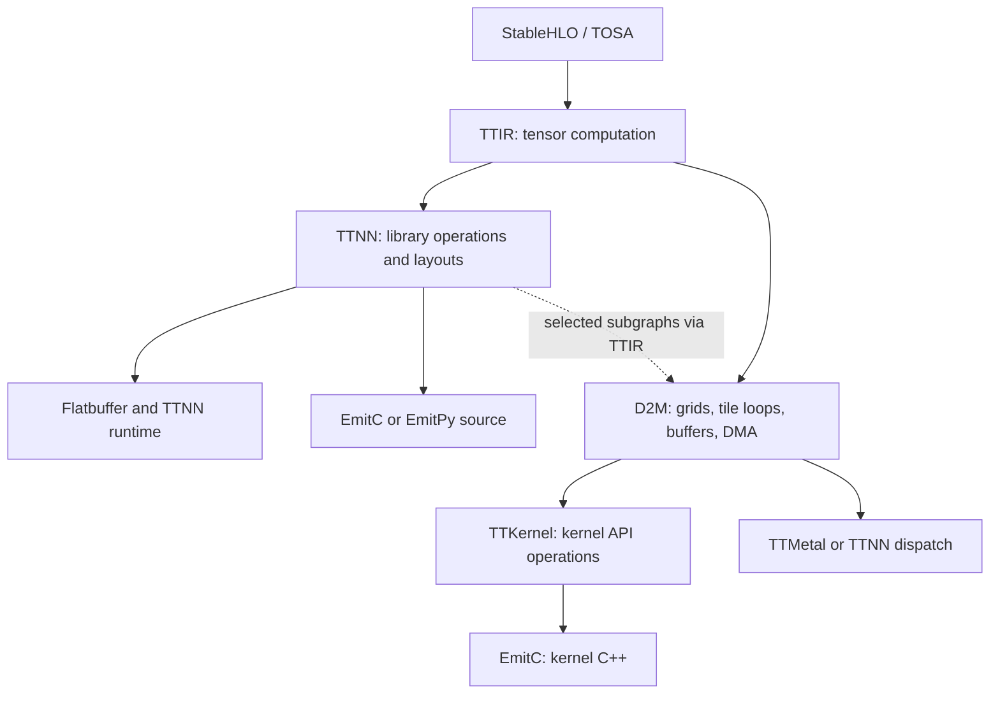

# TT-MLIR source guide and exercises

Source map and worked exercises for the pinned September 2026 checkout. Validation scope and source revisions are retained in the chapters below.

## TT-MLIR: a concrete reason to learn MLIR

For how this design differs from tinygrad, read the [cross-project comparison and coverage assessment](../design-comparison.md).

Audited checkout: `/home/boop/tenstorrent/tt-mlir`, upstream `main` revision `33e83a87d335d9f6b6cb066384230382f8a3cd38`, updated and inspected September 17, 2026. The checkout was already present and clean; it was updated from `ce5a7485ed9dbd785fc5e810ea2f9910de9a1b7d` and the map revalidated against the update. This is a source-reading map, not a hardware-validation report or a claim to have read every implementation. No compiler build or silicon tests were run; `build/bin/ttmlir-opt` was absent.

**Evidence convention:** “Observed” means the linked source defines or schedules the behavior. “Interpretation” explains the architectural benefit and is my inference, not a statement of author intent. Links lead into this checkout; the revision above is the reproducibility boundary. Start with the [general MLIR map](../mlir/README.md#mlir) for operations, regions, interfaces, and dialect conversion, then use this repository to see what those abstractions buy on Tenstorrent.

### Start with the implementation choice

Suppose you want to run `y = x / sqrt(mean(x*x) + epsilon)` on a Tenstorrent device. One approach calls a library that already implements normalization. Another builds the compute and data-transfer programs needed to perform it. TT-MLIR supports both responsibilities. That choice explains its multiple routes better than memorizing dialect names.

An **IR** is the compiler's editable program representation; a **dialect** defines part of its vocabulary. **Lowering** replaces a description with more concrete implementation choices. A **pass** performs one analysis or transformation. The [shared first-principles guide](../first-principles.md) covers these terms across projects. Here, TTIR describes tensor math, TTNN describes library calls, and D2M describes how work and storage are distributed over the device.

The useful distinction is between **compiling a graph into calls to TTNN operations** and **generating the compute and data-movement kernels themselves**. This revision contains both, plus a hybrid route that introduces D2M-generated subgraphs into TTNN. Do not read every dialect as one compulsory linear chain.

Before reading the routes, distinguish an **operator** (a math operation in IR), a **kernel function** (code executed by a device processor), and a **dispatch** (an invocation of a device program). A Tenstorrent program can contain cooperating compute and data-movement kernels. One TTNN operator therefore does not establish one kernel function or one dispatch.

The input names StableHLO and TOSA denote frontend tensor dialects. EmitC is an MLIR representation used to produce C/C++ source; a Flatbuffer is a serialized data format consumed by the runtime. These are different representations and output products, not additional arithmetic stages.

Observed entry points: [TTIR pipelines](../../../tt-mlir/lib/Dialect/TTIR/Pipelines/TTIRPipelines.cpp), [TTNN pipelines](../../../tt-mlir/lib/Dialect/TTNN/Pipelines/TTNNPipelines.cpp), and [D2M pipelines](../../../tt-mlir/lib/Dialect/D2M/Pipelines/D2MPipelines.cpp). Paths in this document are relative to the documentation directory, not the repository root.

### Hardware vocabulary needed for the map

A logical tensor shape, such as `[32,3200]`, says which elements exist. A **layout** says how those elements are arranged in memory and distributed among cores. A **grid** names the arrangement of participating cores; a **shard** is the portion assigned to one core. A **tile** is a small block used by the hardware; the RMSNorm example uses 32×32 tiles. Tiling can introduce padded elements, so **masking** prevents padding from affecting results.

**DRAM** provides large device memory. **L1** is local on-chip memory associated with a core. **DMA** (direct memory access) moves data without having compute instructions copy each element. **NoC** (network on chip) connects cores and memory. A completed computation does not automatically mean a separate transfer has completed; the schedule must establish both dependencies.

A **circular buffer (CB)** is a bounded queue of tiles shared by cooperating producer/consumer work. Reserving space, publishing produced tiles, waiting for input, and releasing consumed tiles prevent overwrite and premature reads. **DST** names destination registers used for compute results; operations must coordinate their use because capacity is limited. **SFPU** is the scalar floating-point unit used for elementwise work, and SFPI is its programming interface. You do not need their instruction sets to understand why the compiler tracks these resources.

**Bufferization** turns tensor values into concrete memory-backed values, represented using `memref` types where appropriate. **Destination-passing style** gives an operation an output operand describing a candidate destination; it does not itself authorize overwriting any still-visible old value. An **indexing map** relates loop coordinates to tensor coordinates, and **iterator types** distinguish independent output loops from reduction loops. A block factor describes how much work is grouped together.

### Dialect-by-dialect map

Read the TTIR, TTNN, and D2M rows first. The other dialects describe shared hardware facts, later implementation stages, or alternate output paths. The table is a source index after the conceptual explanation above.

The “why” column is interpretation; the source and represented objects are observed.

| Abstraction and source | What lives here | Why keep this boundary? | Sharp edge / question to ask |
|---|---|---|---|
| [TTCore](../../../tt-mlir/include/ttmlir/Dialect/TTCore/IR/TTCoreOpsTypes.td), [operations](../../../tt-mlir/include/ttmlir/Dialect/TTCore/IR/TTCoreOps.td) | Shared device, grid, tile, memory-space, and layout vocabulary; device/CPU module structure. Search `TTCore_MetalLayoutAttr`, `TTCore_Tile`. | Multiple lowering routes need the same hardware facts without owning each other's compute operations. | A logical tensor shape does not determine physical placement. Inspect encoding/layout attributes and device description as well. |
| [TTIR definitions](../../../tt-mlir/include/ttmlir/Dialect/TTIR/IR/TTIROps.td), [implementation](../../../tt-mlir/lib/Dialect/TTIR/IR/TTIROps.cpp) | Tensor-level operations and their verifiers; decomposition and tensor-movement rewrites in `Transforms`. | Normalize frontend semantics once, then choose TTNN, D2M, or CPU lowering. | A mathematically familiar op still has dtype, rank, broadcasting, and lowering constraints. Read its verifier and decomposition before treating it as backend-ready. |
| [TTNN definitions](../../../tt-mlir/include/ttmlir/Dialect/TTNN/IR/TTNNOps.td), [transforms](../../../tt-mlir/lib/Dialect/TTNN/Transforms) | Operations corresponding to the TTNN API, layouts, memory configuration, compute configuration, deallocation, workarounds, and generated-kernel integration. | The library supplies kernel implementations; the compiler concentrates on selecting and connecting legal calls. | A legal IR operation and a fast library invocation are different properties. Layout search, device constraints, workarounds, and allocation remain necessary. |
| [D2M generic](../../../tt-mlir/include/ttmlir/Dialect/D2M/IR/D2MOps.td), [region operations](../../../tt-mlir/include/ttmlir/Dialect/D2M/IR/D2MGenericRegionOps.td) | `d2m.generic` dispatches over a grid with indexing maps, block factors, iterator types, thread attributes, inputs/outputs, and regions. Region ops model tile compute, remote accesses, and DMA. | Keep spatial distribution, data movement, and tile computation available for coordinated scheduling before emitting concrete kernel APIs. | “D2M IR” is not one fixed stage. Tensor versus memref, unified versus split threads, implicit versus explicit data movement are materially different forms. |

#### Kernel implementation and output representations

| Abstraction and source | What lives here | Why keep this boundary? | Sharp edge / question to ask |
|---|---|---|---|
| [TTKernel](../../../tt-mlir/include/ttmlir/Dialect/TTKernel/IR/TTKernelOps.td), [conversion](../../../tt-mlir/lib/Conversion/D2MToTTKernel/D2MToTTKernel.cpp) | Kernel library operations: NoC, circular buffers, tile compute, and register/control protocols. | Retain structured operations long enough to reason about hardware protocols before turning them into source calls. | Matching a numerical op is insufficient: initialization, CB synchronization, DST ownership, arguments, and compute/data-movement roles must agree. |
| [TTMetal](../../../tt-mlir/include/ttmlir/Dialect/TTMetal/IR/TTMetalOps.td) | Host-side program enqueue and buffer transfer operations; `TTMetal_EnqueueProgramOp` is a starting point. | Dispatching a grid of kernels and executing instructions inside a kernel are separate jobs. | Kernel correctness alone does not validate dispatch buffers, argument packing, or launch metadata. |
| [SFPI](../../../tt-mlir/include/ttmlir/Dialect/SFPI/IR/SFPIOps.td), [SFPI to EmitC](../../../tt-mlir/lib/Conversion/SFPIToEmitC/SFPIToEmitC.cpp) | SFPU programming-interface operations. | Express finer-grained SFPU code with MLIR structure. | Its existence does not imply every TTNN or D2M operation passes through it. Trace the selected pipeline. |
| [EmitPy](../../../tt-mlir/include/ttmlir/Dialect/EmitPy/IR/EmitPyOps.td), [Python target](../../../tt-mlir/lib/Target/Python) | An IR for producing Python source; TTNN and CPU lowering feed it. | Source export benefits from explicit expressions, imports, variable names, and module linking. | Python export has its own preparation and workaround passes. Runtime-flatbuffer support does not automatically establish Python-export support. |
| [Debug](../../../tt-mlir/include/ttmlir/Dialect/Debug), [StableHLO extensions](../../../tt-mlir/lib/Dialect/StableHLO), [Linalg](../../../tt-mlir/lib/Dialect/Linalg), [LLVM](../../../tt-mlir/lib/Dialect/LLVM) | Debug operations and local transformations around upstream dialects. | Reuse upstream representations while adding project-specific conversion and inspection. | Directory names `Linalg` and `LLVM` do not mean independent replacements for upstream dialects. Inspect registration and conversion targets. |

### The rest of the repository, by responsibility

These modules answer four successive questions: can the input be represented, which layout/schedule should implement it, how is the result packaged, and how does the runtime execute it? **Canonicalization** simplifies an existing representation; **decomposition** replaces a broad operation with simpler operations a backend supports. A **schema** specifies the serialized format shared by compiler and runtime. **JIT** means compiling as part of running the program.

| Module | Read here | Role and reason it exists |
|---|---|---|
| Frontend conversion | [StableHLOToTTIR](../../../tt-mlir/lib/Conversion/StableHLOToTTIR), [TosaToTTIR](../../../tt-mlir/lib/Conversion/TosaToTTIR) | Translate source semantics and types into the project's tensor vocabulary. This is where an unsupported frontend feature first becomes explicit. |
| Experimental frontend/runtime integration | [tt-crank](../../../tt-mlir/tt-crank/README.md), [engine compiler](../../../tt-mlir/tt-crank/src/engine/compile.cpp), [Torch integration](../../../tt-mlir/tt-crank/python/tt_crank/torch) | New subproject with a thin compiler/runtime frontend and Torch backend. `compile.cpp` calls `createTTIRToTTNNRuntimePipeline` and emits a Flatbuffer; this is another entry into the existing compiler, not a replacement IR stack. Its README explicitly calls it experimental. |
| Decomposition | [TTIRToTTIRDecomposition](../../../tt-mlir/lib/Conversion/TTIRToTTIRDecomposition) | Replace broad tensor operations with a smaller lowerable set. Distinct from ordinary canonicalization: a canonical mathematical op can still require decomposition for the backend. |
| Cross-dialect lowering | [Conversion](../../../tt-mlir/lib/Conversion) | Named source/destination directories expose where contracts change: TTIR→TTNN, TTIR→D2M, D2M→TTKernel, D2M→TTMetal/TTNN, and source-export conversions. |
| Layout/performance analysis | [TTNN Analysis](../../../tt-mlir/lib/Dialect/TTNN/Analysis), [OpModel](../../../tt-mlir/lib/OpModel/TTNN), [optimizer design](../../../tt-mlir/docs/src/specs/ttnn-optimizer.md) | Model legal configurations and optimize layouts. `TTNNOpModel.cpp` and `SingletonDeviceContext.cpp` make the connection to device/library knowledge concrete. Do not assume every optimizer mode is available in a compiler-only build. |
| Scheduling | [Scheduler](../../../tt-mlir/lib/Scheduler/Scheduler.cpp), [D2M transforms](../../../tt-mlir/lib/Dialect/D2M/Transforms) | There is shared scheduling machinery and D2M-specific scheduling/allocation. Distinguish graph scheduling from tile/DST and DMA scheduling. |
| Cross-cutting transforms/support | [Transforms](../../../tt-mlir/lib/Transforms), [Support](../../../tt-mlir/lib/Support) | CPU/constant-evaluation coordination and common infrastructure span individual dialects. A pipeline can contain host computation as well as device work. |

#### Packaging, execution, and developer tools

| Module | Read here | Role and reason it exists |
|---|---|---|
| Binary boundary | [schemas](../../../tt-mlir/include/ttmlir/Target), [serializers](../../../tt-mlir/lib/Target), [binary runtime](../../../tt-mlir/runtime/lib/binary.cpp) | Compiler IR becomes a runtime-consumable artifact. Adding a runtime operation can require schema, serializer, and executor changes in addition to a rewrite. |
| Runtime | [dispatch](../../../tt-mlir/runtime/lib/runtime.cpp), [TTNN](../../../tt-mlir/runtime/lib/ttnn), [TTMetal](../../../tt-mlir/runtime/lib/ttmetal), [distributed](../../../tt-mlir/runtime/lib/distributed) | Execute artifacts, manage devices/tensors, and choose enabled runtime implementations. Availability depends on build configuration; it is not implied by a directory existing. |
| Bindings | [C API](../../../tt-mlir/lib/CAPI), [Python bindings](../../../tt-mlir/python), [Python package](../../../tt-mlir/python/ttmlir) | Expose compiler operations, attributes, passes, and configuration to Python. Generated binding definitions and handwritten wrappers cooperate. This is distinct from exporting a model as Python source. |
| Driver tools | [ttmlir-opt](../../../tt-mlir/tools/ttmlir-opt), [ttmlir-translate](../../../tt-mlir/tools/ttmlir-translate), [ttrt](../../../tt-mlir/tools/ttrt) | Transform IR, translate artifacts, and query/run artifacts respectively. They exercise different layers; passing the first is not evidence that the last works. |
| Interactive/specialized tooling | [builder](../../../tt-mlir/tools/builder), [pykernel](../../../tt-mlir/tools/pykernel), [d2m-jit](../../../tt-mlir/tools/d2m-jit), [ttnn-jit](../../../tt-mlir/tools/ttnn-jit), [explorer](../../../tt-mlir/tools/explorer), [tt-alchemist](../../../tt-mlir/tools/tt-alchemist) | Construct IR, author kernels, JIT selected paths, inspect compilation, and work with generated code. Pick one workflow after understanding its entry IR. |
| Validation/build | [test](../../../tt-mlir/test), [runtime tests](../../../tt-mlir/runtime/test), [env](../../../tt-mlir/env), [third_party](../../../tt-mlir/third_party), [CMake](../../../tt-mlir/CMakeLists.txt) | Parser/verifier tests, conversion FileChecks, runtime tests, and silicon/performance tests establish different guarantees. Dependency configuration is part of reproducibility. |

### Read a lowering as a sequence of obligations

#### TTIR → TTNN

This route delegates numerical implementation to the TTNN library. The compiler must still supply supported types, layouts, memory placement, and call arguments. Calling a library moves those kernel implementation responsibilities; it does not make layout and allocation disappear.

Observed in `createTTIRToTTNNCommonPipeline` and its helpers in [TTNNPipelines.cpp](../../../tt-mlir/lib/Dialect/TTNN/Pipelines/TTNNPipelines.cpp): normalization/decomposition and optional fusion precede layout preparation and conversion; later passes handle analysis, workarounds, layouts, memory management, configuration, and optional D2M integration. Many steps are conditional. Read the actual option branches before copying the order into a mental model.

In MLIR conversion, “legal” means allowed to remain after this conversion stage. “Illegal” means the stage must replace it or report failure. A **type converter** describes how input/output types change; an identity converter leaves them unchanged at this particular boundary.

One unusually clear contract is [TTIRToTTNNPass.cpp](../../../tt-mlir/lib/Conversion/TTIRToTTNN/TTIRToTTNNPass.cpp), `ConvertTTIRToTTNNPass::runOnOperation`: TTIR is illegal, TTNN is legal, the type converter initially maps types identically, and `applyFullConversion` failing triggers `signalPassFailure()`. **Interpretation:** this boundary is an explicit completeness check, rather than a hope that enough rewrite rules fired. Type identity here is possible because other passes establish the necessary layouts; it does not mean physical layout is irrelevant.

Output branches matter. `createTTNNCommonToRuntimePipeline`, `createTTNNCommonToEmitCPipeline`, and `createTTNNCommonToEmitPyPipeline` prepare different products. The [add export test](../../../tt-mlir/test/ttmlir/EmitC/TTNN/eltwise_binary/add.mlir) is a compact executable specification: common pipeline first; then one branch produces a Flatbuffer, another emits C++.

Loops introduce an additional obligation. In Python, a loop may update `state` each iteration; in SSA IR, the loop takes an incoming value and yields a new value for the next iteration. These are **loop-carried values**. Their storage and lifetime must be correct across iterations and at loop exit.

The update to this audit's final SHA also adds a useful control-flow example: `TTIR_WhileOp` in [TTIROps.td](../../../tt-mlir/include/ttmlir/Dialect/TTIR/IR/TTIROps.td), [WhileTripCount.cpp](../../../tt-mlir/lib/Dialect/TTIR/Transforms/WhileTripCount.cpp), and the [runtime while executor](../../../tt-mlir/runtime/lib/ttnn/operations/control_flow/while_op.cpp). The TTNN pipeline now invokes the trip-count pass. Its static count is an optional fact discovered for recognized loops, not permission to assume every loop is statically bounded. Follow [while conversion tests](../../../tt-mlir/test/ttmlir/Conversion/StableHLOToTTIR/while_op.mlir) and [layout/deallocation tests](../../../tt-mlir/test/ttmlir/Dialect/TTNN/while/while_layout_and_dealloc.mlir) to see why regions and loop-carried values require more than a flat tensor-DAG model.

#### TTIR → D2M → kernels and dispatch

This route constructs the implementation instead of stopping at a library call. Follow one tile: decide its owner core, allocate storage, arrange its input transfer, wait for readiness, compute using limited registers, and publish the result for its consumer. The stages below make those decisions in an order that retains the information each next stage needs. A **spill** saves a value to temporary storage when the preferred compute storage is insufficient.

Observed in [D2MPipelines.cpp](../../../tt-mlir/lib/Dialect/D2M/Pipelines/D2MPipelines.cpp):

1. **Choose device and normalize tensor semantics.** `createD2MFrontendPipeline` registers the device, normalizes element types, decomposes operations and tensor movements, then converts TTIR→D2M.
2. **Choose spatial layout and fuse.** Grid selection, view materialization, mask optimization, layout lowering, and conditional fusion precede bufferization. Interpretation: retain tensor-level freedom while deciding which work belongs together.
3. **Make storage obligations concrete.** Bufferization, scratch buffers, loop interchange, outer-loop generation, masking decomposition, reblocking, synchronized-buffer marking, and allocation prepare explicit data movement. The pipeline comment requires synchronized buffers to be marked immediately before allocation.
4. **Schedule tile compute and DST access.** `createD2MBackendPipeline` tiles compute loops, schedules operations, inserts spill/scratch and DST accesses, forms tile matmul blocks, and splits SFPU loops. These are hardware resource obligations beyond algebraic equivalence.
5. **Split compute and data movement.** CB allocations are hoisted and unified threads split; DMA scheduling/lowering/optimization then makes remote accesses concrete. Thread arguments are normalized before generic regions become functions.
6. **Preserve kernel structure until dispatch has consumed it.** `createD2MToTTKernelPreEmitCPipeline` converts kernel operations while leaving dispatch conversion able to inspect them. Only later should init hoisting and EmitC lowering erase that structure. The source explicitly cites `TypecastTileOp` locality and BFP8 unpack-mode selection as reasons for this ordering.

The last ordering requirement is concrete: a dispatch builder still needs to know where a tile type conversion happens so it can configure unpacking of BFP8 (a block floating-point format). Replacing the typed operation with generic emitted C++ too early makes that question harder to answer. **Init hoisting** moves initialization outward so it can be shared; it too must wait until the relevant consumer of the original structure has run.

The hybrid route is visible in `createTTNNPipelineD2MPass` in [TTNNPipelines.cpp](../../../tt-mlir/lib/Dialect/TTNN/Pipelines/TTNNPipelines.cpp): it converts TTNN→TTIR before invoking D2M lowering in TTNN mode. **Interpretation:** “library compiler” and “kernel compiler” are useful responsibilities, but not disjoint whole-program product choices.

### Sharp edges worth keeping on a personal checklist

A useful running question is: “Does this transformation only change how an array is described, or must it move bytes or synchronize processors?” The following cases look similar at tensor level but have different implementation obligations.

- **A view is not a transfer.** [D2MOps.td](../../../tt-mlir/include/ttmlir/Dialect/D2M/IR/D2MOps.td), `D2M_ViewLayoutOp`, specifies a representational remapping and no codegen operation; `D2M_ToLayoutOp` can change memory space, dtype, tile shape, or sharding. Treating both as free reshapes loses necessary movement.
- **Destination-passing style does not grant unconditional in-place mutation.** D2M's `DestinationStyleOpInterface` and `BufferizableOpInterface` expose output/aliasing relations, but bufferization must still preserve tensor SSA semantics. Inspect read/write and aliasing methods before assuming a destination can be reused. See [D2M interfaces/implementations](../../../tt-mlir/lib/Dialect/D2M/IR).
- **Canonicalization placement is meaningful.** D2M deliberately disables named redundant-layout folds under `disableToLayoutFolding`; the option is implemented by `createCanonicalizerPassWithOptions`. A pass named “canonicalizer” need not run the same effective pattern set everywhere.
- **Options may not control what their name suggests.** At this revision D2M's op scheduler is hard-enabled with a TODO about DST allocation and elementwise fusion; the assignment comments out `options.enableOpScheduler`. Confirm option wiring in the pipeline, not only the declaration.
- **Pattern failure is not pass failure.** The repository [AGENTS.md](../../../tt-mlir/AGENTS.md) explicitly warns against `emitOpError()` inside a pattern: use `notifyMatchFailure()` for a declined match, and propagate real pass failure from `runOnOperation`. Diagnostics and conversion legality are separate mechanisms.
- **Project overview prose can lag source.** [project-structure.md](../../../tt-mlir/docs/src/project-structure.md) calls the TTMetal runtime unimplemented, while [runtime/lib/ttmetal](../../../tt-mlir/runtime/lib/ttmetal) contains an executor and runtime. [dialects-overview.md](../../../tt-mlir/docs/src/dialects-overview.md) also lacks the D2M map present in current source. These are concrete reasons to start from pipeline definitions.

### What transfers to a direct tinygrad Blackhole backend?

This is an architectural comparison, not an assertion that upstream tinygrad uses these dialects. A direct backend still needs decisions about tile representation, distributed storage, CB synchronization, DST lifetime, separate compute/data-movement programs, launch arguments, and artifact execution. D2M is particularly useful as a catalog of those obligations. TTNN lowering answers a different question: how to express the workload through existing library operations.

Tinygrad's UOp rewriting and MLIR rewrite patterns both make local transformations composable, but a TT-MLIR dialect conversion additionally names legal/illegal operations and may reject a whole IR if conversion is incomplete. A tinygrad PatternMatcher and an MLIR PassManager are also different things despite both sometimes being abbreviated “PM”: one dispatches rewrite rules; the other sequences passes. Compare the [tinygrad map](../tinygrad/module-map.md#module-map) and the existing [Blackhole backend notes](../../archive/tinygrad/blackhole-backend-map.md).

For learning, first trace `tosa.add`→TTIR, then TTIR→TTNN, then one D2M layout/synchronization case. That gives three useful scales: operation semantics, library integration, and hardware scheduling. The [worked exercises](README.md#exercises) follow that order.

For the requested complex example, read [RMSNorm and fusion between kernels](rmsnorm-kernel-fusion.md): it traces tensor recognition, library dispatch, an explicit three-kernel multicore implementation, and the synchronization obligations that prevent casually collapsing its boundaries.

## TT-MLIR exercises and worked answers

Source revision and evidence limitations are in the [map](README.md#tt-mlir). Exercises 1–8 are source-reading tasks with worked answers; commands are optional and have not been executed against a built compiler here. These are curriculum seeds, not measured performance claims.

### Before starting

Read the [map's implementation choice and hardware vocabulary](README.md#tt-mlir--start-with-the-implementation-choice). Then work through these exercises in order: they move from translating an addition to preserving memory, scheduling, and device-launch obligations. Try each prediction before reading the worked answer.

A test's `RUN` line is its command template. The `lit` test runner substitutes filenames and tool paths; `FileCheck` compares emitted text against expected patterns. A matching text pattern is structural evidence about compiler output. Running the compiled program and comparing numbers is a separate check. A **verifier** checks an operation's own rules; **conversion failure** means a transformation could not produce the allowed destination representation.

### 1. Find the smallest dialect-conversion experiment

**Task (20 minutes).** Read [TOSA add conversion test](../../../tt-mlir/test/ttmlir/Conversion/TosaToTTIR/elementwise_binary/add.mlir). Identify the input operation, expected output, command, and assertion mechanism. Explain why this does not establish device execution.

**Worked answer.** Its RUN lines invoke `ttmlir-opt --convert-tosa-to-ttir` and then `FileCheck`. The test checks the textual lowering of TOSA addition into TTIR. It does not serialize an artifact, launch a device, or compare numerical outputs. After a configured build, run the repository's `llvm-lit` command on this test, or use its RUN lines with actual filenames replacing lit substitutions. A complete submission distinguishes parsing, conversion structure, and numerical execution as separate claims.

### 2. Why isn't a rewrite set enough?

**Task (25 minutes).** In [TTIRToTTNNPass.cpp](../../../tt-mlir/lib/Conversion/TTIRToTTNN/TTIRToTTNNPass.cpp), find the conversion target, type conversion, rewrite population, and failure propagation. Predict what happens if an unsupported TTIR op survives.

**Worked answer.** Imagine every addition converted successfully but one unsupported normalization remained. A matcher can simply decline that last candidate, so “the matchers finished” would be too weak a success condition. TTIR is declared illegal and TTNN legal. An identity type conversion is registered and `populateTTIRToTTNNPatterns` supplies rewrites. `applyFullConversion` must satisfy legality; failure calls `signalPassFailure()`. Therefore a surviving illegal TTIR op cannot count as successful full conversion. The identity conversion says what this pass does to types, not that preceding layout preparation is unnecessary. The grading criterion is naming both the legality check and the pass-failure mechanism.

### 3. Is this layout change free?

**Task (30 minutes).** Compare `D2M_ViewLayoutOp` and `D2M_ToLayoutOp` in [D2MOps.td](../../../tt-mlir/include/ttmlir/Dialect/D2M/IR/D2MOps.td). Classify a representational affine remapping and a DRAM→L1 transfer. Find where view returns are materialized in the pipeline.

**Worked answer.** Compare reinterpreting an existing array's indices with copying it to another memory bank. The first can change how consumers calculate addresses; the second must make bytes available in a new location. `view_layout` is specified as a representational view with a remapping attribute and no codegen operation; consumers compose the layout. `to_layout` covers memory-space, dtype, tile-size, and sharding changes and has memory effects. DRAM→L1 needs actual storage/movement, not merely renamed indexing. `createD2MFrontendPipeline` schedules `createD2MMaterializeViewReturns` at multiple stages; returning a view can require materialization even when an internal view is free. Inspect [materialize_view_returns.mlir](../../../tt-mlir/test/ttmlir/Dialect/D2M/materialize_view_returns.mlir) for concrete expected IR. Do not infer that every `to_layout` must survive optimization: redundant transitions can fold.

### 4. Tensor destination versus physical buffer

**Task (30 minutes).** Read `D2M_GenericOp` and its interfaces. Explain why output operands and SSA results coexist, and why an output operand alone does not prove an operation mutates a unique allocation.

**Worked answer.** Suppose `old` is still read after an operation produces `new`. Using old's allocation as a destination must not destroy the old value before that read. This is why the compiler cannot equate an output operand with unrestricted mutation. The op participates in destination-passing style: outputs identify candidate result storage relationships while tensor results preserve SSA value semantics. Its `BufferizableOpInterface` methods describe reads, writes, aliasing, buffer types, and writability. Bufferization resolves the physical realization while preserving observable behavior; aliases or live tensor values can prevent unsafe reuse. In [D2MPipelines.cpp](../../../tt-mlir/lib/Dialect/D2M/Pipelines/D2MPipelines.cpp), TTNN mode uses upstream one-shot bufferization with specified options, while the non-TTNN path uses TTCore's custom pass for Metal layouts. A good answer identifies both interface and pipeline policy.

### 5. Recover an ordering dependency from source

**Task (35 minutes).** Explain why moving EmitC conversion before D2M→TTMetal conversion is suspect. Name the concrete information at risk.

**Worked answer.** The dispatch builder needs to answer a hardware configuration question before the operation carrying the answer is erased. Comments around `createD2MToTTKernelPreEmitCPipeline` and `createTTIRToTTMetalPipeline` state that dispatch-level conversion inspects TTKernel operation structure, including `TypecastTileOp` locality for BFP8 unpack-mode selection. Early EmitC lowering would replace that structure with lower-level source constructs. Init hoisting is likewise deliberately delayed. This is an information-preservation dependency, not merely stylistic ordering. Submit the producer of the information, the consuming conversion, and the pass that would erase it.

### 6. Explain the apparently ignored option

**Task (15 minutes).** Search `enableOpScheduler` in [D2MPipelines.cpp](../../../tt-mlir/lib/Dialect/D2M/Pipelines/D2MPipelines.cpp). Does setting the corresponding options object field false necessarily turn off the scheduler in this pipeline?

**Worked answer.** No. This revision explicitly assigns `true` to the scheduler pass option and leaves `options.enableOpScheduler` commented out. The accompanying TODO links that choice to DST allocation consistency with elementwise fusion. This is an observed snapshot fact, not a prediction about future revisions. An exercise extension is to find a test covering the dependency; absence of one is a research question rather than evidence the dependency is false.

### 7. One model, two products

**Task (30 minutes).** Read [EmitC add test](../../../tt-mlir/test/ttmlir/EmitC/TTNN/eltwise_binary/add.mlir). Draw the common stage and output branches. List the additional surfaces needed to add a brand-new runtime operation.

**Worked answer.** The common TTIR→TTNN pipeline produces shared IR. A runtime preparation branch feeds `ttmlir-translate --ttnn-to-flatbuffer`; an EmitC branch feeds `--mlir-to-cpp`. For a new Flatbuffer-runtime operation, inspect the TTNN op definition/verifier, conversion pattern, schema, serializer, and runtime executor, plus tests. The [adding-an-op guide](../../../tt-mlir/docs/src/adding-an-op.md) enumerates these surfaces and also discusses bindings, builder, and CPU-hoisting support. Supporting one product does not by itself validate all other products. The test's `%system_desc_path%` and temporary-path variables are lit substitutions, not shell environment syntax.

### 8. Design a direct-backend audit

**Task (45 minutes).** You want to lower a fused elementwise-plus-reduction kernel for Blackhole without relying on a preexisting TTNN operation. Use D2M to write a review checklist; do not implement the backend.

**Worked answer.** Trace one output tile from inputs to completed storage. First establish which logical elements it represents and which core owns it. Then establish where its inputs arrive, when compute may read them, where results wait, and when a consumer may use them. With that execution story in mind, check logical versus padded shape and masking; grid/indexing maps; tile/block factors; L1 and DRAM allocation; buffer lifetimes and spill policy; compute scheduling and DST capacity; CB producer/consumer synchronization; DMA completion and NoC addressing; thread-argument normalization; and dispatch metadata. These obligations correspond to visible stages in `createD2MFrontendPipeline` and `createD2MBackendPipeline`. Proving the scalar algebra is insufficient to prove this implementation. A strong submission pairs each item with a pipeline stage and proposes both an IR-structure test and a numerical/runtime test. This checklist is an inference from TT-MLIR's design, not a claim that tinygrad must reproduce its dialect structure.

### Optional implementation project: test an existing invariant

Choose [D2M layout tests](../../../tt-mlir/test/ttmlir/Dialect/D2M/lower_to_layout.mlir), [negative remote-access tests](../../../tt-mlir/test/ttmlir/Dialect/D2M/remote_load_store_negative.mlir), or [thread-argument normalization](../../../tt-mlir/test/ttmlir/Dialect/D2M/arguments/normalize_thread_args.mlir). Copy a small case into a scratch file, predict the result, then run the exact RUN-line pass with the configured toolchain. Change one property at a time. Record the commit, command, actual diagnostic/IR, and explanation.

**Solution standard.** A complete result explains the invariant before showing output, captures a minimal counterexample, and distinguishes a verifier rejection from a conversion failure. For a source patch, follow the repository's pattern-error guidance: a rejected candidate uses `notifyMatchFailure`; an actual pass failure must propagate appropriately. No patch or execution for this optional project is claimed in these notes.
