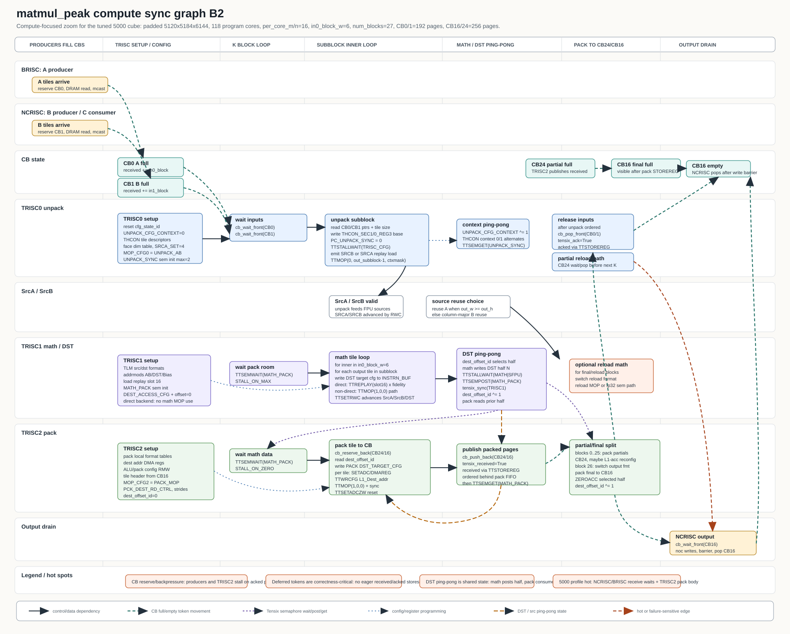

# matmul_peak Compute Sync Graph B2

`matmul-peak-compute-sync-graph-b2.svg` is a compute-only zoom of the original graph B. It keeps B's readable lane style, but expands the TRISC pipeline, CB full/empty states, MOP/replay programming, config writes, and DST/SrcA/SrcB state.

Scope: tuned `examples/matmul_peak.py 5000 5000 5000` on the current p100a profile data:

- padded shape: `5120x5184x6144`
- program cores: `118`
- `per_core_m=16`, `per_core_n=16`
- `in0_block_w=6`, `num_blocks=27`
- CB pages: `CB0=192`, `CB1=192`, `CB16=256`, `CB24=256`

## Review Notes

The original graph B was a good overview but collapsed compute into three boxes:

- `TRISC0 unpack`
- `TRISC1 math`
- `TRISC2 pack`

B2 adds the missing correctness detail:

- TRISC0 setup: cfg state reset, unpack context reset, tile descriptors, face dims, `SRCA_SET`, `MOP_CFG0`, and `UNPACK_SYNC`.
- TRISC0 body: CB0/CB1 wait, THCON base address writes, `PC_UNPACK_SYNC`, source replay load, unpack MOP, unpack context ping-pong, and deferred input CB ack.
- TRISC1 setup/body: replay slot 16 load, math addrmods, `MATH_PACK`, direct backend `TTREPLAY`, optional non-direct math MOP path, `TTSETRWC`, and `dest_offset_id` flip.
- TRISC2 setup/body: pack local format tables, pack config/RMW, tile header, pack MOP config, output DMA regs, CB16/CB24 reserve, pack destination config, pack MOP, deferred received publication, `MATH_PACK` get, zeroacc, and `dest_offset_id` flip.
- CB state transitions: CB0/CB1 full to TRISC0, CB24 partial full to reload, CB16 final full to NCRISC output, and CB16 empty after output write barrier/pop.

Important nuance: the default current `MATH_BACKEND` is `direct`, so the hot math body uses replay from slot 16 instead of the non-direct math `TTMOP` path. Unpack and pack still have their own MOP configuration and emission paths.

## Source Anchors

- TRISC0 unpack setup/body: `examples/matmul_peak.py:2035`, `examples/matmul_peak.py:2194`, `examples/matmul_peak.py:2829`
- TRISC1 math setup/body: `examples/matmul_peak.py:2473`, `examples/matmul_peak.py:2653`, `examples/matmul_peak.py:2922`
- TRISC2 pack setup/body: `examples/matmul_peak.py:2730`, `examples/matmul_peak.py:2791`, `examples/matmul_peak.py:2998`
- CB token machinery: `ttk/cb.py:110`
- unpack/math/pack config helpers: `ttk/unpack.py:111`, `ttk/math.py:59`, `ttk/pack.py:153`
