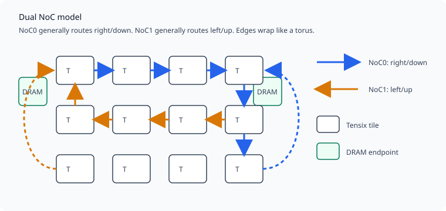
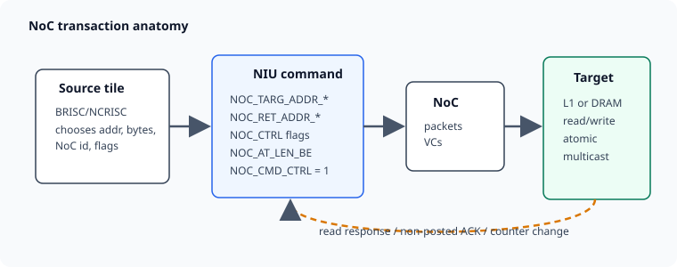
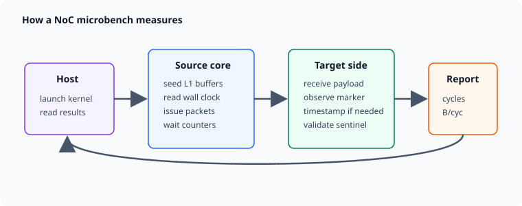

# NoC Reading Guide From Zero

This guide is the on-ramp for the NoC reports in this archive. Read it before
opening the raw benchmark tables.

## 1. The Mental Model

Blackhole is a grid of tiles joined by two independent Networks-on-Chip:

- **NoC0** usually routes right/down.
- **NoC1** usually routes left/up.
- The edges wrap, so each NoC behaves like a torus rather than a flat grid.
- Each Tensix tile has local **L1** memory and two **NIUs**: one command
  interface for NoC0 and one for NoC1.

A NoC operation is a DMA-style transaction. A source core programs NIU registers,
fires the command, and the NoC moves bytes to or from another endpoint. The
remote RISC core does not have to run code for a plain L1 read/write to happen.

## 2. Coordinates

NoC reports mix several coordinate spaces:

| term | meaning |
|---|---|
| physical/raw | actual router coordinates on the chip |
| translated/logical | harvesting-aware coordinates exposed by firmware/software |
| route | the physical path a packet takes after translation |
| endpoint | a tile-like destination: Tensix L1, DRAM, Ethernet, PCIe, etc. |

When a table shows both `source`/`target` and `raw route`, the first pair is the
programmed benchmark endpoint and the raw route is the model's physical path.
Harvested columns and DRAM/L2 columns make Blackhole coordinates look nonuniform;
that is expected.

For the full coordinate background, read `../../../hardware/coordinates-and-translation.md`.

## 3. Transaction Types

| type | what it does | common report clue |
|---|---|---|
| posted write | source sends bytes and does not wait for an ACK | fastest write rows, no completion dependency |
| non-posted write | source waits for a write ACK/counter | `RESP_MARKED`, `WR_ACK`, sender done cycles |
| read | source sends request, target returns data | read response counter or return buffer |
| inline write | 32-bit immediate from an NIU register | small control/semaphore writes |
| atomic | target-side read-modify-write on L1 | semaphore/inc/CAS/accumulate rows |
| multicast | one source writes a rectangle of Tensix targets | rectangle, fanout, linked/path-reserve rows |

Blackhole's maximum NoC payload packet is 16 KiB. Larger transfers are loops of
16 KiB commands, so reports often sweep `bytes`, `packets`, or `iters`.

## 4. Virtual Channels

Virtual channels are routing/ordering lanes inside a NoC. Most reports care
about three flags:

- `VC_STATIC`: force a selected VC instead of dynamic allocation.
- `VC_LINKED`: link a command sequence for ordering and better multicast source
  behavior.
- `ARB_PRIORITY`: priority field for VC allocation under contention.

Start with `noc-vc-command-flags.md` only after you understand simple packet
latency and stream bandwidth; otherwise the priority results look mysterious.

## 5. What a Microbench Measures

Most NoC microbenches follow the same loop:

1. Host launches one or more tiny RISC-V kernels.
2. Source cores seed L1 buffers and read wall-clock counters.
3. Source cores issue NoC commands through NIU registers.
4. Target buffers or marker words prove data arrived.
5. Source and/or target record timestamps and counters.
6. Host reads a result record and appends a markdown table.

Common table columns:

| column | read it as |
|---|---|
| `noc` | 0 or 1: which fabric instance issued the traffic |
| `source`, `target`, `pairs` | programmed endpoints |
| `raw route`, `hops`, `shared links` | physical route model |
| `bytes`, `packets`, `iters` | payload shape |
| `issue`, `done`, `seen`, `window cyc` | sender/receiver timing windows |
| `B/cyc`, `GB/s` | derived payload throughput |
| `sent ctr`, `resp ctr`, `polls` | NIU completion/counter evidence |
| `bad sentinel` | validation failures; nonzero means distrust the row |

Sender-side bandwidth answers "how fast could the initiator issue or complete?"
Receiver-side bandwidth answers "how fast did the destination observe useful
payload?" Both matter because command issue, routing, endpoint ingress, and
responses can bottleneck different cases.

## 6. Suggested Reading Order

1. `../../status.md`: current high-level state.
2. This guide.
3. `../../../hardware/architecture.md`, NoC section.
4. `../../../hardware/coordinates-and-translation.md`.
5. `noc-topology.md`: route direction and wrap behavior.
6. `noc-stream-sweep.md`: basic L1-to-L1 stream throughput.
7. `noc-packet-latency.md` and `noc-dependency-latency.md`: latency and completion dependencies.
8. `dram-noc-bench.md` and `noc-dram-endpoint-matrix.md`: DRAM endpoint behavior.
9. `noc-arbitration.md`, `noc-crossing-vc-probe.md`, `noc-vc-command-flags.md`: contention, VCs, priority.
10. `noc-mcast-scheduler-calibration.md` and overlay reports: multicast and stream overlay behavior.
11. `noc-scheduler-model.md`: fitted model after the raw measurements make sense.

## 7. Common Pitfalls

- Do not compare NoC0 and NoC1 routes by coordinates alone; they route in
  opposite directions and may use mirrored physical coordinates.
- Do not treat translated coordinates as raw router coordinates.
- Do not trust a throughput row with bad sentinels, missing response counters,
  or a timeout note.
- Do not assume posted writes imply remote completion at the moment the sender
  finishes issuing.
- Do not generalize from single-stream bandwidth to many-to-one, same-link, or
  DRAM endpoint traffic; those stress different resources.
